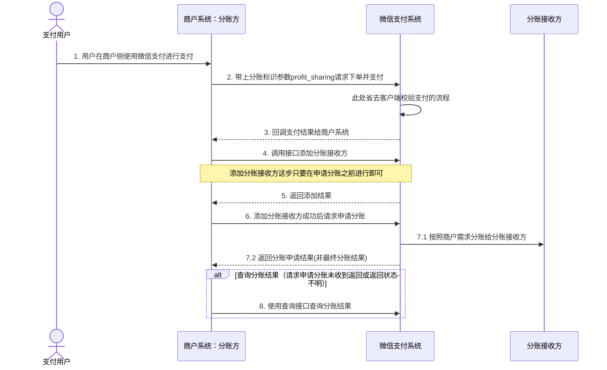

>更新时间：2026.06.10

## 接入流程图

## 开发步骤

步骤4：服务商代子商户发起添加分账接收方请求（[添加分账接收方接口](https://pay.weixin.qq.com/doc/v2/partner/4011984782.md))，商户的分账接收方数量上限为2万。若已达到上限，可删除部分未使用的接收方后重新添加；

步骤6：在[统一下单API](https://pay.weixin.qq.com/doc/v2/partner/4011936644.md)、[付款码支付API](https://pay.weixin.qq.com/doc/v2/partner/4011941293.md)、[委托扣款API](https://pay.weixin.qq.com/doc/v2/partner/4011988372.md)中上传参数 `profit_sharing`，请求支付。支付完成后，调用[请求单次分账接口](https://pay.weixin.qq.com/doc/v2/partner/4011984565.md)或[请求多次分账接口](https://pay.weixin.qq.com/doc/v2/partner/4011984646.md)；

步骤7：请求分账接口采用异步处理模式，即在接收到商户请求后，会先受理请求（受理请求返回的结果非最终分账结果）再异步处理，最终的分账结果需要通过[查询分账结果接口](https://pay.weixin.qq.com/doc/v2/partner/4011984717.md)获取；

步骤8：调用[查询分账结果接口](https://pay.weixin.qq.com/doc/v2/partner/4011984717.md)，根据 `receivers.result` 判断每个接收方的分账结果，如返回 `CLOSED：已关闭`，可根据返回的 `receivers.fail_reason` 分账失败原因参考[分账失败处理指引](https://pay.weixin.qq.com/doc/v2/partner/4015505153.md)进行处理。

| 字段名 | 变量名 | 必填 | 类型 | 示例值 | 描述 |
| --- | --- | --- | --- | --- | --- |
| 是否指定服务商分账 | profit\_sharing | 否 | String(16) | Y | Y-是，需要分账 N-否，不分账 字母要求大写，不传默认不分账 |

说明：实现分账只是在普通支付下单接口中新增了一个分账参数profit\_sharing，其他与普通支付方式完全相同。目前支持付款码支付、JSAPI支付、Native支付、APP支付、小程序支付、H5支付、委托代扣、车主平台。