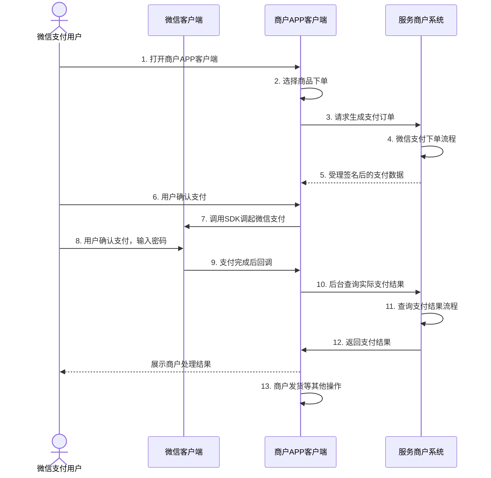
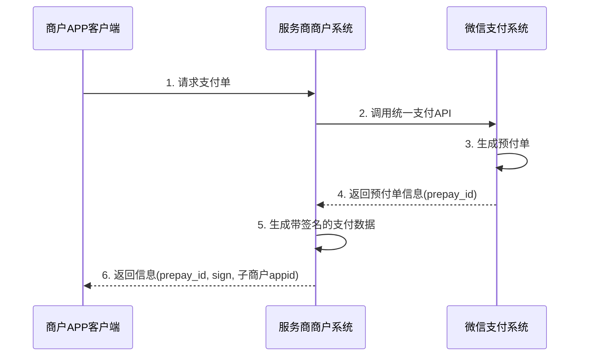
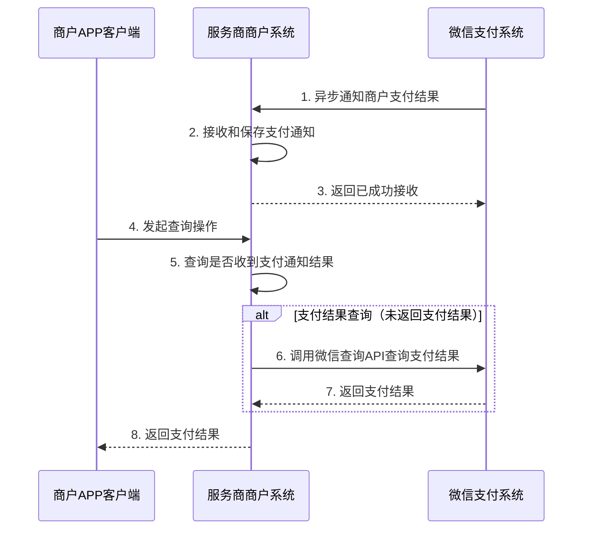

>更新时间：2026.06.10

## 一、子商户APP中提交支付

以下是子商户APP中调用支付的交互时序图，如下图所示。服务商提供的接口实现请参见下文第2节。

商户APP调用支付的主要交互说明：

1.用户在商户APP中选择商品，选择微信支付，提交订单，如图中步骤1-3所示。

2.调用服务商提供的下单接口，服务商后台收到下单请求，会返回签好名的订单数据，用于商户APP里面调起微信支付，如图中步骤3-5所示。

3.用户确认支付，输入密码，支付完成，如图中步骤6-8所示。

4.支付完成后，微信返回商户APP，回调APP实现的回调函数，此时需要根据单号调用服务商提供的查询结果，查询后台实际支付结果，再做用户页面展示和发货操作。如图步骤9-13.

## 二、服务商处理支付流程

以下是服务商接收到子商户APP中下单请求的处理流程交互时序图

服务商后台主要交互说明：

1.接收到下单请求后，服务商系统调用微信支付[【统一下单API】](https://pay.weixin.qq.com/doc/v2/partner/4011941377.md)，微信返回prepay\_id等参数，如图步骤2-4所示。

2.服务商系统获取到prepay\_id后，按照[【调起支付API】](https://pay.weixin.qq.com/doc/v2/partner/4011941437.md)列表中的参数进行签名(服务商开发注意，appid和partnerid都不是服务商的参数，appid是子商户的应用APPID，partnerid是子商户的商户号)，将数据返回给商户APP端，如图中步骤5-6所示。

## 三、服务商支付结果查询

以下是服务商接收到子商户APP中查单请求的处理流程交互时序图

服务商后台主要交互说明：

1.服务商系统需要具备接收微信支付通知的能力，实现请见[【微信支付通知API】](https://pay.weixin.qq.com/doc/v2/partner/4011941679.md)，接收到支付通知后，可以定义接口将该通知转给子商户，或者服务商系统保存支付结果，供后续查询，如图步骤1-3所示。

2.商户APP提交查询支付结果，服务商系统先查询是否收到支付通知，如果未成功接收，请调用[【微信支付查单API】](https://pay.weixin.qq.com/doc/v2/partner/4011941754.md)（查单实现可参考：[支付回调和查单实现指引](https://pay.weixin.qq.com/doc/v2/partner/4011984698.md)），将微信返回的实际查询结果返回给商户，如图步骤4-8所示。