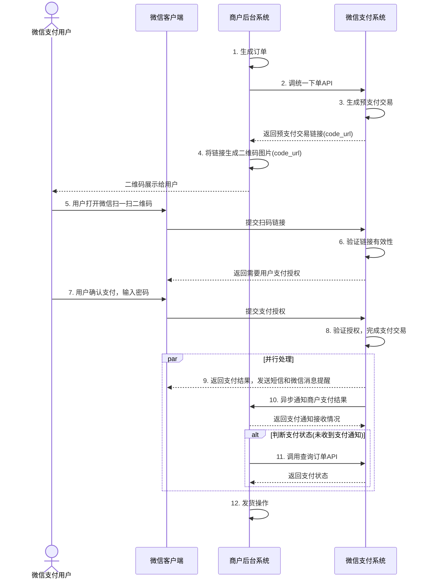

>更新时间：2026.06.10

商户后台系统先调用微信支付的统一下单接口，微信后台系统返回链接参数code\_url，商户后台系统将code\_url值生成二维码图片，用户使用微信客户端扫码后发起支付。注意：code\_url有效期为2小时，过期后扫码不能再发起支付。

## 业务流程时序图

图6.9 原生扫码支付时序图

业务流程说明：

（1）商户后台系统根据用户选购的商品生成订单。

（2）用户确认支付后调用微信支付【[统一下单API](https://pay.weixin.qq.com/doc/v2/partner/4011989255.md)】生成预支付交易；

（3）微信支付系统收到请求后生成预支付交易单，并返回交易会话的二维码链接code\_url。

（4）商户后台系统根据返回的code\_url生成二维码。

（5）用户打开微信“扫一扫”扫描二维码，微信客户端将扫码内容发送到微信支付系统。

（6）微信支付系统收到客户端请求，验证链接有效性后发起用户支付，要求用户授权。

（7）用户在微信客户端输入密码，确认支付后，微信客户端提交授权。

（8）微信支付系统根据用户授权完成支付交易。

（9）微信支付系统完成支付交易后给微信客户端返回交易结果，并将交易结果通过短信、微信消息提示用户。微信客户端展示支付交易结果页面。

（10）微信支付系统通过发送异步消息通知商户后台系统支付结果。商户后台系统需回复接收情况，通知微信后台系统不再发送该单的支付通知。

（11）未收到支付通知的情况，商户后台系统调用【[查询订单API](https://pay.weixin.qq.com/doc/v2/partner/4011989256.md)】（查单实现可参考：[支付回调和查单实现指引](https://pay.weixin.qq.com/doc/v2/partner/4011984698.md)）。

（12）商户确认订单已支付后给用户发货。

## 生成二维码规则

对应链接格式：weixin://wxpay/bizpayurl?sr=123456。请商户调用第三方库将code\_url生成二维码图片。该模式链接较短，生成的二维码打印到结账小票上的识别率较高。

例如，将weixin://wxpay/bizpayurl?sr=123456生成二维码见图6.10。

图6.10 原生扫码支付二维码示例

## 二维码相关知识

参考文献：

商品二维码标准： [国家商品二维码标准](http://c.gb688.cn/bzgk/gb/showGb?type=online&hcno=F5AD425C27157698599E7B19DF7128E6)

名片二维码： [名片二维码通用技术规范](http://c.gb688.cn/bzgk/gb/showGb?type=online&hcno=CA759A0DC00BF44159CAF4D7670CA5B2)

QR码官方介绍： [QR码官方](https://www.qrcode.com/zh/index.html)