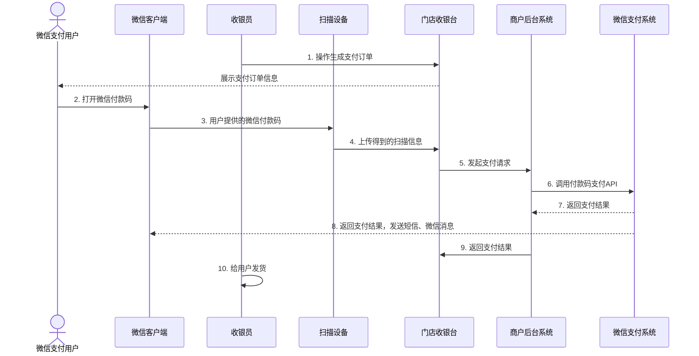
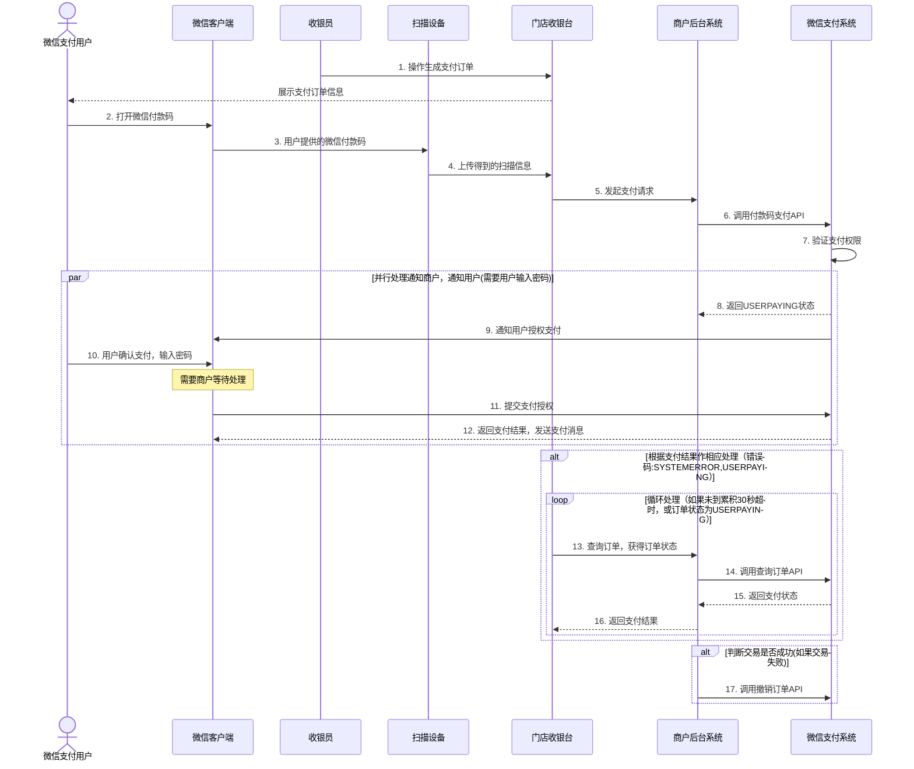

>更新时间：2026.06.10

根据商户具体的情况，付款码支付接入模式可分为：商户后台接入和门店接入；

根据用户是否需要输入支付密码可分为：免密模式和验密模式。

## 1、接入模式-商户后台接入

该模式适合具备统一后台系统的商户。门店收银台与商户后台通信，商户后台系统负责与微信支付系统发送交易请求和接收返回结果。

图5.4 商户后台接入付款码支付

## 2、免密支付流程

本节以商户后台接入模式说明支付流程，请参看以下时序图：

图5.6 付款码支付免密流程时序图

流程详细说明：

（1）收银员在商户收银台生成支付订单，向用户展示支付金额；

（2）用户打开微信客户端，点击“我的钱包”，选择“付款码”，进入条码界面；

（3）使用扫码设备读取用户手机屏幕上的条码；

（4）扫码设备将读取的信息上传给门店收银台；

（5）门店收银台得到支付信息后，向商户收银后台发起支付请求。

（6）商户后台对门店收银台的支付请求进行处理，生成签名后调用【[付款码支付API](https://pay.weixin.qq.com/doc/v2/partner/4011941293.md)】向微信支付系统发起支付请求。

（7）微信支付系统得到商户侧的支付请求之后会对请求进行验证，验证通过之后会对请求数据进行处理，最后将处理后的支付结果返回给商户收银后台。如果支付成功，微信支付系统会将支付结果返回给商户，同时把支付结果通知给用户（以短信、微信消息的形式通知）。

（8）商户收银后台对得到的支付结果进行签名验证和处理，再将支付结果返回给门店收银台。

（9）收银员看到门店收银台的支付结果后给用户发货。

## 3、验密支付流程

场景交互与免密模式相同，不同的是在商户调用【[付款码支付API](https://pay.weixin.qq.com/doc/v2/partner/4011941293.md)】发起支付请求之后，微信支付后台提示用户输入密码确认支付，接口同步返回USERPAYING状态，商户系统再轮询调用查询订单接口来确认当前用户是否已经支付成功。

以下时序图说明验密支付流程

图5.7付款码支付验证密码流程时序图

流程详细说明：

（1）收银员在商户收银台生成支付订单，向用户展示支付金额；

（2）用户打开微信客户端，点击“我的钱包”，选择“付款码”，进入条码界面；

（3）使用扫码设备读取用户手机屏幕上的条码；

（4）扫码设备将读取的信息上传给门店收银台；

（5）商户门店生成订单后，收银台向后台系统发起支付请求。

（6）商户后台对门店收银台的支付请求进行处理，生成签名后调用【[提交付款码支付API](https://pay.weixin.qq.com/doc/v2/partner/4011941293.md)】向微信支付系统发起支付请求。

（7）微信支付系统得到商户侧的支付请求之后会对请求进行验证，验证通过后判断当前用户需要输入密码。

（8）微信支付系统返回USERPAYING状态，商户后台系统将应答结果返回给商户门店收银台。

（9）微信支付系统通知用户微信客户端输入密码。

（10）用户得到输入密码提示后，确认支付并输入密码。

（11）完成密码输入，提交微信支付。

（12）微信客户端在用户完成支付后提示微信支付后台系统返回的支付结果，而且微信支付系统会通过短信、微信消息给用户发送支付结果提醒。

（13）商户收银台得到USERPAYING状态后，经过商户后台系统调用【[查询订单API](https://pay.weixin.qq.com/doc/v2/partner/4012202507.md)】查询实际支付结果。

（14）如果支付结果仍为USERPAYING，则每隔5秒循环调用【[查询订单API](https://pay.weixin.qq.com/doc/v2/partner/4012202507.md)】判断实际支付结果，如果用户取消支付或累计30秒用户都未支付，商户收银台退出查询流程后继续调用【[撤销订单API](https://pay.weixin.qq.com/doc/v2/partner/4012218602.md)】撤销支付交易。

## 4、异常处理

用户遇到支付异常，请按如下说明处理

（1）用户微信端弹出系统错误提示框，用户可在交易列表查看交易情况，如果未找到订单，需要商户重新发起支付交易；如果订单显示成功支付，商户收银系统再次调用【[查询订单API](https://pay.weixin.qq.com/doc/v2/partner/4012202507.md)】查询实际支付结果；

（2）用户微信端弹出支付失败提示，例如：余额不足，信用卡失效。需要重新发起支付；

（3）当交易超时或支付交易失败，商户收银系统必须调用【[撤销订单API](https://pay.weixin.qq.com/doc/v2/partner/4012218602.md)】（详见公共API），撤销此交易。

（4）由于银行系统异常、用户余额不足、不支持用户卡种等原因使当前支付交易失败，商户收银系统应该把错误提示明确展示给收银员。

（5）根据返回的错误码，判断是否需要撤销交易，具体详见API返回错误码列表