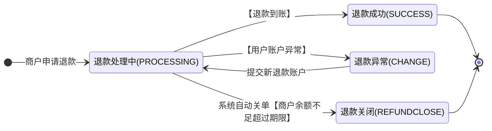

>更新时间：2025.03.21

## 应用场景

当交易发生之后一段时间内，由于买家或者卖家的原因需要退款时，卖家可以通过退款接口将支付款退还给买家，微信支付将在收到退款请求并且验证成功之后，按照退款规则将支付款按原路退到买家账号上。

注意：

1、交易时间超过一年的订单无法提交退款

2、微信支付退款支持单笔交易分多次退款，多次退款需要提交原支付订单的商户订单号和设置不同的退款单号。申请退款总金额不能超过订单金额。一笔退款失败后重新提交，请不要更换退款单号，请使用原商户退款单号

3、请求频率限制：150qps，即每秒钟正常的申请退款请求次数不超过150次

4、每个支付订单的部分退款次数不能超过50次

5、如果同一个用户有多笔退款，建议分不同批次进行退款，避免并发退款导致退款失败

6、申请退款接口的返回仅代表业务的受理情况，具体退款是否成功，需要通过退款查询接口获取结果。

7、一个月之前的订单申请退款频率限制为：5000/min

8、同一笔订单多次退款的请求需相隔1分钟

## 状态机

退款状态转变如下：



## 接口地址

接口链接：https://api.mch.weixin.qq.com/secapi/pay/refund

## 是否需要证书

请求需要双向证书。 详见[证书使用](https://pay.weixin.qq.com/doc/v2/merchant/4011985891.md)

### 请求参数

| 字段名 | 变量名 | 必填 | 类型 | 示例值 | 描述 |
| --- | --- | --- | --- | --- | --- |
| 公众账号ID | appid | 是 | String(32) | wx8888888888888888 | 微信分配的公众账号ID（企业号corpid即为此appid） |
| 商户号 | mch\_id | 是 | String(32) | 1900000109 | 微信支付分配的商户号 |
| 随机字符串 | nonce\_str | 是 | String(32) | 5K8264ILTKCH16CQ2502SI8ZNMTM67VS | 随机字符串，不长于32位。推荐[随机数生成算法](https://pay.weixin.qq.com/doc/v2/merchant/4011985891.md) |
| 签名 | sign | 是 | String(32) | C380BEC2BFD727A4B6845133519F3AD6 | 签名，详见[签名生成算法](https://pay.weixin.qq.com/doc/v2/merchant/4011985891.md) |
| 签名类型 | sign\_type | 否 | String(32) | HMAC-SHA256 | 签名类型，目前支持HMAC-SHA256和MD5，默认为MD5 |
| 微信支付订单号 | transaction\_id | 二选一 | String(32) | 1217752501201407033233368018 | 微信生成的订单号，在支付通知中有返回 |
| 订单金额 | total\_fee | 是 | int | 100 | 订单总金额，单位为分，只能为整数，详见[支付金额](https://pay.weixin.qq.com/doc/v2/merchant/4011941162.md) |
| 退款金额 | refund\_fee | 是 | int | 100 | 退款总金额，订单总金额，单位为分，只能为整数，详见[支付金额](https://pay.weixin.qq.com/doc/v2/merchant/4011941162.md) |
| 退款货币种类 | refund\_fee\_type | 否 | String(8) | CNY | 退款货币类型，需与支付一致，或者不填。符合ISO 4217标准的三位字母代码，默认人民币：CNY，其他值列表详见[货币类型](https://pay.weixin.qq.com/doc/v2/merchant/4011941162.md) |
| 退款原因 | refund\_desc | 否 | String(80) | 商品已售完 | 若商户传入，会在下发给用户的退款消息中体现退款原因<br>注意：若订单退款金额≤1元，且属于部分退款，则不会在退款消息中体现退款原因 |
| 退款资金来源 | refund\_account | 否 | String(30) | REFUND\_SOURCE\_RECHARGE\_FUNDS | 仅针对老资金流商户使用<br>REFUND\_SOURCE\_UNSETTLED\_FUNDS---未结算资金退款（默认使用未结算资金退款）<br>REFUND\_SOURCE\_RECHARGE\_FUNDS---可用余额退款 |
| 退款结果通知url | notify\_url | 否 | String(256) | https://weixin.qq.com/notify/ | 异步接收微信支付退款结果通知的回调地址，通知URL必须为外网可访问的url，不允许带参数<br>公网域名必须为https，如果是走专线接入，使用专线NAT IP或者私有回调域名可使用http<br>如果参数中传了notify\_url，则商户平台上配置的回调地址将不会生效。 |

举例如下：

```
<xml>
   <appid>wx2421b1c4370ec43b</appid>
   <mch_id>10000100</mch_id>
   <nonce_str>6cefdb308e1e2e8aabd48cf79e546a02</nonce_str>
   <out_refund_no>1415701182</out_refund_no>
   <out_trade_no>1415757673</out_trade_no>
   <refund_fee>1</refund_fee>
   <total_fee>1</total_fee>
   <transaction_id>4006252001201705123297353072</transaction_id>
   <sign>FE56DD4AA85C0EECA82C35595A69E153</sign>
</xml>
```

## 返回结果

| 字段名 | 变量名 | 必填 | 类型 | 示例值 | 描述 |
| --- | --- | --- | --- | --- | --- |
| 返回状态码 | return\_code | 是 | String(16) | SUCCESS | SUCCESS/FAIL<br>此字段是通信标识，表示接口层的请求结果，并非退款状态。 |
| 返回信息 | return\_msg | 是 | String(128) | OK | 当return\_code为FAIL时返回信息为错误原因 ，例如<br>签名失败<br>参数格式校验错误 |

以下字段在return\_code为SUCCESS的时候有返回

| 字段名 | 变量名 | 必填 | 类型 | 示例值 | 描述 |
| --- | --- | --- | --- | --- | --- |
| 业务结果 | result\_code | 是 | String(16) | SUCCESS | SUCCESS/FAIL<br>SUCCESS退款申请接收成功，结果通过退款查询接口查询<br>FAIL 提交业务失败 |
| 错误代码 | err\_code | 否 | String(32) | SYSTEMERROR | 列表详见错误码列表 |
| 错误代码描述 | err\_code\_des | 否 | String(128) | 系统超时 | 结果信息描述 |
| 公众账号ID | appid | 是 | String(32) | wx8888888888888888 | 微信分配的公众账号ID |
| 商户号 | mch\_id | 是 | String(32) | 1900000109 | 微信支付分配的商户号 |
| 随机字符串 | nonce\_str | 是 | String(32) | 5K8264ILTKCH16CQ2502SI8ZNMTM67VS | 随机字符串，不长于32位 |
| 签名 | sign | 是 | String(32) | 5K8264ILTKCH16CQ2502SI8ZNMTM67VS | 签名，详见[签名算法](https://pay.weixin.qq.com/doc/v2/merchant/4011985891.md) |
| 微信支付订单号 | transaction\_id | 是 | String(32) | 4007752501201407033233368018 | 微信订单号 |
| 微信退款单号 | refund\_id | 是 | String(32) | 2007752501201407033233368018 | 微信退款单号 |
| 退款金额 | refund\_fee | 是 | int | 100 | 退款总金额,单位为分,可以做部分退款 |
| 应结退款金额 | settlement\_refund\_fee | 否 | int | 100 | 去掉非充值代金券退款金额后的退款金额，退款金额=申请退款金额-非充值代金券退款金额，退款金额<=申请退款金额 |
| 标价金额 | total\_fee | 是 | int | 100 | 订单总金额，单位为分，只能为整数，详见[支付金额](https://pay.weixin.qq.com/doc/v2/merchant/4011941162.md) |
| 应结订单金额 | settlement\_total\_fee | 否 | int | 100 | 去掉非充值代金券金额后的订单总金额，应结订单金额=订单金额-非充值代金券金额，应结订单金额<=订单金额。 |
| 标价币种 | fee\_type | 否 | String(8) | CNY | 订单金额货币类型，符合ISO 4217标准的三位字母代码，默认人民币：CNY，其他值列表详见[货币类型](https://pay.weixin.qq.com/doc/v2/merchant/4011941162.md) |
| 现金支付金额 | cash\_fee | 是 | int | 100 | 现金支付金额，单位为分，只能为整数，详见[支付金额](https://pay.weixin.qq.com/doc/v2/merchant/4011941162.md) |
| 现金支付币种 | cash\_fee\_type | 否 | String(16) | CNY | 货币类型，符合ISO 4217标准的三位字母代码，默认人民币：CNY，其他值列表详见[货币类型](https://pay.weixin.qq.com/doc/v2/merchant/4011941162.md) |
| 现金退款金额 | cash\_refund\_fee | 否 | int | 100 | 现金退款金额，单位为分，只能为整数，详见[支付金额](https://pay.weixin.qq.com/doc/v2/merchant/4011941162.md) |
| 代金券类型 | coupon\_type\_$n | 否 | String(8) | CASH | CASH--充值代金券<br>NO\_CASH---非充值代金券<br>订单使用代金券时有返回（取值：CASH、NO\_CASH）。$n为下标,从0开始编号，举例：coupon\_type\_0 |
| 代金券退款总金额 | coupon\_refund\_fee | 否 | int | 100 | 代金券退款金额<=退款金额，退款金额-代金券或立减优惠退款金额为现金，说明详见[代金券或立减优惠](https://pay.weixin.qq.com/doc/v3/merchant/4012084079.md) |
| 单个代金券退款金额 | coupon\_refund\_fee\_$n | 否 | int | 100 | 代金券退款金额<=退款金额，退款金额-代金券或立减优惠退款金额为现金，说明详见[代金券或立减优惠](https://pay.weixin.qq.com/doc/v3/merchant/4012084079.md) |
| 退款代金券使用数量 | coupon\_refund\_count | 否 | int | 1 | 退款代金券使用数量 |
| 退款代金券ID | coupon\_refund\_id\_$n | 否 | String(20) | 10000 | 退款代金券ID, $n为下标，从0开始编号 |

举例如下：

```
<xml>
   <return_code><![CDATA[SUCCESS]]></return_code>
   <return_msg><![CDATA[OK]]></return_msg>
   <appid><![CDATA[wx2421b1c4370ec43b]]></appid>
   <mch_id><![CDATA[10000100]]></mch_id>
   <nonce_str><![CDATA[NfsMFbUFpdbEhPXP]]></nonce_str>
   <sign><![CDATA[B7274EB9F8925EB93100DD2085FA56C0]]></sign>
   <result_code><![CDATA[SUCCESS]]></result_code>
   <transaction_id><![CDATA[1008450740201411110005820873]]></transaction_id>
   <out_trade_no><![CDATA[1415757673]]></out_trade_no>
   <out_refund_no><![CDATA[1415701182]]></out_refund_no>
   <refund_id><![CDATA[2008450740201411110000174436]]></refund_id>
   <refund_fee>1</refund_fee>
</xml>
```

## 错误码

| 名称 | 描述 | 原因 | 解决方案 |
| --- | --- | --- | --- |
| SYSTEMERROR | 接口返回错误 | 系统超时等 | 请不要更换商户退款单号，请使用相同参数再次调用API。 |
| BIZERR\_NEED\_RETRY | 退款业务流程错误，需要商户触发重试来解决 | 并发情况下，业务被拒绝，商户重试即可解决 | 请不要更换商户退款单号，请使用相同参数再次调用API。 |
| TRADE\_OVERDUE | 订单已经超过退款期限 | 订单已经超过可退款的最大期限(支付后一年内可退款) | 请选择其他方式自行退款 |
| ERROR | 业务错误 | 申请退款业务发生错误 | 该错误都会返回具体的错误原因，请根据实际返回做相应处理。 |
| USER\_ACCOUNT\_ABNORMAL | 退款请求失败 | 用户账号注销 | 此状态代表退款申请失败，商户可自行处理退款。 |
| INVALID\_REQ\_TOO\_MUCH | 无效请求过多 | 连续错误请求数过多被系统短暂屏蔽 | 请检查业务是否正常，确认业务正常后请在1分钟后再来重试 |
| NOTENOUGH | 余额不足 | 商户可用退款余额不足 | 此状态代表退款申请失败，商户可根据具体的错误提示做相应的处理。 |
| INVALID\_TRANSACTIONID | 无效transaction\_id | 请求参数未按指引进行填写 | 请求参数错误，检查原交易号是否存在或发起支付交易接口返回失败 |
| PARAM\_ERROR | 参数错误 | 请求参数未按指引进行填写 | 请求参数错误，请重新检查再调用退款申请 |
| APPID\_NOT\_EXIST | APPID不存在 | 参数中缺少APPID | 请检查APPID是否正确 |
| MCHID\_NOT\_EXIST | MCHID不存在 | 参数中缺少MCHID | 请检查MCHID是否正确 |
| ORDERNOTEXIST | 订单号不存在 | 缺少有效的订单号 | 请检查你的订单号是否正确且是否已支付，未支付的订单不能发起退款 |
| REQUIRE\_POST\_METHOD | 请使用post方法 | 未使用post传递参数 | 请检查请求参数是否通过post方法提交 |
| SIGNERROR | 签名错误 | 参数签名结果不正确 | 请检查签名参数和方法是否都符合签名算法要求 |
| XML\_FORMAT\_ERROR | XML格式错误 | XML格式错误 | 请检查XML参数格式是否正确 |
| FREQUENCY\_LIMITED | 频率限制 | 1个月之前的订单申请退款有频率限制 | 该笔退款为受理中，请调用查单接口确认或降低频率原单重试，重试请勿更换单号 |
| NOAUTH | 异常IP请求不予受理 | 请求ip异常 | 请求退款的IP地址与商户平台配置的IP地址不一致。<br>解决方法：商户号超管登录[商户平台](https://pay.weixin.qq.com/)，通过路径「交易中心→退款管理→退款配置→退款IP白名单→开启配置」，进入配置页面后可开启/关闭白名单功能和配置IP地址；动态IP建议关闭IP配置，静态IP检查与配置的IP列表是否一致。 |
| CERT\_ERROR | 证书校验错误 | 请检查证书是否正确，证书是否过期或作废。 | 请检查证书是否正确，证书是否过期或作废。 |
| INVALID\_REQUEST | 请求参数符合参数格式，但不符合业务规则 | 此状态代表退款申请失败，商户可根据具体的错误提示做相应的处理。 | 此状态代表退款申请失败，商户可根据具体的错误提示做相应的处理。 |
| ORDER\_NOT\_READY | 订单处理中，暂时无法退款，请稍后再试 | 订单处理中，暂时无法退款，请稍后再试 | 订单处理中，暂时无法退款，请稍后再试 |