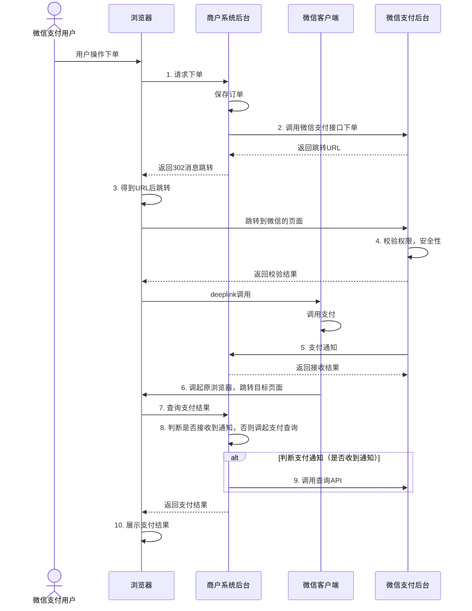
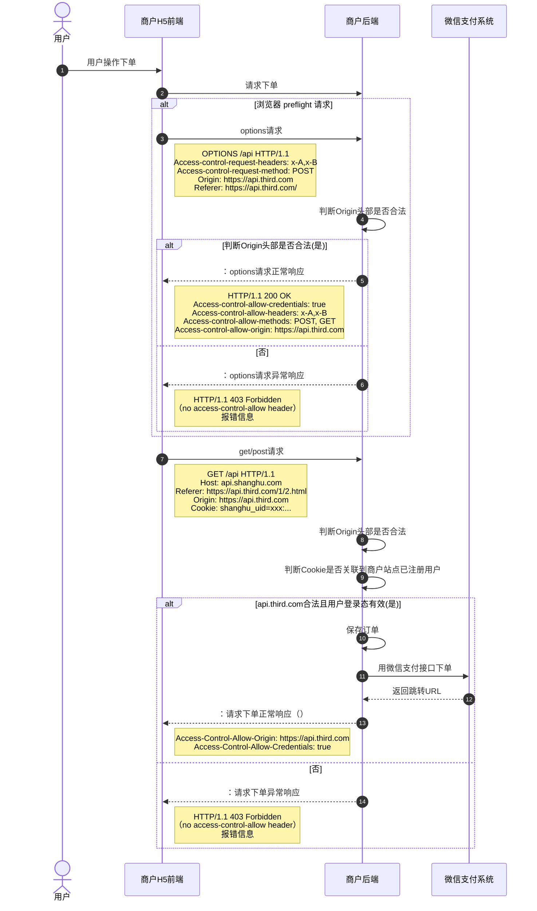

>更新时间：2026.06.10

## 接口流程图

## 安全标准规范流程图

1、 用户向商户系统后台请求下单，商户后台必须做好安全校验

- 当跨域请求不是[简单请求](https://developer.mozilla.org/zh-CN/docs/Web/HTTP/CORS#%E7%AE%80%E5%8D%95%E8%AF%B7%E6%B1%82)时，浏览器会发起Options[预检请求](https://developer.mozilla.org/zh-CN/docs/Web/HTTP/CORS#%E9%A2%84%E6%A3%80%E8%AF%B7%E6%B1%82)，此时商户后台需要支持Options请求且校验Origin头部，如果不在允许的白名单列表内，则返回403且不返回 `Access-Control-Allow-*` 相关头部

- 针对GET/POST的跨域下单请求，商户后台需要校验Origin头部是否合法且用户Cookie是否完备（若用户未登陆则先引导登陆商户站点），否则返回403且不返回 `Access-Control-Allow-*` 相关头部

2、由商户后台向微信支付发起下单请求（[调用统一下单接口](https://pay.weixin.qq.com/doc/v2/merchant/4011937163.md)）注：交易类型trade\_type=MWEB

3、统一下单接口返回支付相关参数给商户后台，如支付跳转url（参数名“mweb\_url”），商户通过mweb\_url调起微信支付中间页

4、中间页进行H5权限的校验，安全性检查（此处常见错误请见下文）

5、如支付成功，商户后台会接收到微信侧的异步通知

6、用户在微信支付收银台完成支付或取消支付,返回商户页面（默认为返回支付发起页面）

7、商户在展示页面，引导用户主动发起支付结果的查询

8,、商户后台判断是否接收到微信侧的支付结果通知，如没有，后台调用我们的[订单查询接口](https://pay.weixin.qq.com/doc/v2/merchant/4011937309.md)确认订单状态（查单实现可参考：[支付回调和查单实现指引](https://pay.weixin.qq.com/doc/v2/merchant/4011984682.md)）

9、展示最终的订单支付结果给用户

注意：

- 商户需按照安全规范进行接入，若因未遵循规范接入而出现安全问题，财付通将根据《[微信支付服务协议](https://pay.weixin.qq.com/index.php/public/apply_sign/protocol)》条款处理

- 以上图示，仅为示例，只供参考。请商户自行确认是否实现了跨越访问白名单限制和用户登录态校验。