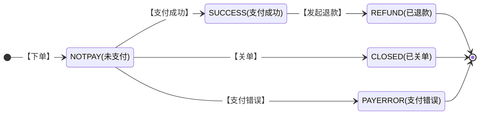

>更新时间：2026.06.08

## 应用场景

除付款码支付场景以外，商户系统先调用该接口在微信支付服务后台生成预支付交易单，返回正确的预支付交易会话标识后再按Native、JSAPI、APP等不同场景生成交易串调起支付。

## 状态机

支付状态转变如下：



## 接口链接

URL地址：https://api.mch.weixin.qq.com/pay/unifiedorder

URL地址：https://api2.mch.weixin.qq.com/pay/unifiedorder(备用域名)[见跨城冗灾方案](https://pay.weixin.qq.com/doc/v2/merchant/4011984887.md)

## 是否需要证书

否

## 请求参数

| 字段名 | 变量名 | 必填 | 类型 | 示例值 | 描述 |
| :-- | :-- | :-- | :-- | :-- | :-- |
| 公众账号ID | appid | 是 | String(32) | wxd678efh567hg6787 | 微信支付分配的公众账号ID（企业号corpid即为此appid）<br>注意：appid参数为小写字母“i” |
| 商户号 | mch\_id | 是 | String(32) | 1230000109 | 微信支付分配的商户号 |
| 设备号 | device\_info | 否 | String(32) | 013467007045764 | 自定义参数，可以为终端设备号(门店号或收银设备ID)，PC网页或公众号内支付可以传"WEB" |
| 随机字符串 | nonce\_str | 是 | String(32) | 5K8264ILTKCH16CQ2502SI8ZNMTM67VS | 随机字符串，长度要求在32位以内。推荐[随机数生成算法](https://pay.weixin.qq.com/doc/v2/merchant/4011985891.md) |
| 签名 | sign | 是 | String(32) | C380BEC2BFD727A4B6845133519F3AD6 | 通过签名算法计算得出的签名值，详见[签名生成算法](https://pay.weixin.qq.com/doc/v2/merchant/4011985891.md) |
| 签名类型 | sign\_type | 否 | String(32) | MD5 | 签名类型，默认为MD5，支持HMAC-SHA256和MD5。 |
| 商品描述 | body | 是 | String(127) | 腾讯充值中心-QQ会员充值 | 商品简单描述，该字段请按照规范传递，具体请见[参数规定](https://pay.weixin.qq.com/doc/v2/merchant/4011941162.md) |
| 商品详情 | detail | 否 | String(6144) | \[{<br>"goods\_detail":\[<br>{<br>"goods\_id":"iphone6s\_16G",<br>"wxpay\_goods\_id":"1001",<br>"goods\_name":"iPhone6s 16G",<br>"quantity":1,<br>"price":528800,<br>"goods\_category":"123456",<br>"body":"苹果手机"<br>},<br>{<br>"goods\_id":"iphone6s\_32G",<br>"wxpay\_goods\_id":"1002",<br>"goods\_name":"iPhone6s 32G",<br>"quantity":1,<br>"price":608800,<br>"goods\_category":"123789",<br>"body":"苹果手机"<br>}<br>\]<br>}\] | 商品详细描述，对于使用单品优惠的商户，该字段必须按照规范上传，详见“[单品优惠参数说明](https://pay.weixin.qq.com/doc/v2/partner/4011983265.md)” |
| 附加数据 | attach | 否 | String(127) | 深圳分店 | 附加数据，在查询API和支付通知中原样返回，可作为自定义参数使用。 |
| 标价币种 | fee\_type | 否 | String(16) | CNY | 符合ISO 4217标准的三位字母代码，默认人民币：CNY，详细列表请参见[货币类型](https://pay.weixin.qq.com/doc/v2/merchant/4011941162.md) |
| 标价金额 | total\_fee | 是 | int | 88 | 订单总金额，单位为分，详见[支付金额](https://pay.weixin.qq.com/doc/v2/merchant/4011941162.md) |
| 终端IP | spbill\_create\_ip | 是 | String(64) | 123.12.12.123 | 支持IPV4和IPV6两种格式的IP地址。用户的客户端IP |
| 交易起始时间 | time\_start | 否 | String(14) | 20091225091010 | 订单生成时间，格式为yyyyMMddHHmmss，如2009年12月25日9点10分10秒表示为20091225091010。其他详见[时间规则](https://pay.weixin.qq.com/doc/v2/merchant/4011941162.md) |
| 交易结束时间 | time\_expire | 否 | String(14) | 20091227091010 | 订单失效时间，格式为yyyyMMddHHmmss，如2009年12月27日9点10分10秒表示为20091227091010。 |
| 订单优惠标记 | goods\_tag | 否 | String(32) | WXG | 订单优惠标记，使用代金券或立减优惠功能时需要的参数，说明详见[代金券或立减优惠](https://pay.weixin.qq.com/doc/v3/merchant/4012084133.md) |
| 通知地址 | notify\_url | 是 | String(256) | https://www.weixin.qq.com/wxpay/pay.php | body 异步接收微信支付结果通知的回调地址，通知url必须为外网可访问的url，不能携带参数。 公网域名必须为https，如果是走专线接入，使用专线NAT IP或者私有回调域名可使用http |
| 交易类型 | trade\_type | 是 | String(16) | JSAPI | JSAPI -JSAPI支付<br>NATIVE -Native支付<br>APP -APP支付<br>说明详见[参数规定](https://pay.weixin.qq.com/doc/v2/merchant/4011941162.md) |
| 商品ID | product\_id | 否 | String(32) | 12235413214070356458058 | trade\_type=NATIVE时，此参数必传。此参数为二维码中包含的商品ID，商户自行定义。 |
| 用户标识 | openid | 否 | String(128) | oUpF8uMuAJO\_M2pxb1Q9zNjWeS6o | trade\_type=JSAPI时（即JSAPI支付），此参数必传，此参数为微信用户在商户对应appid下的唯一标识。openid如何获取，可参考【[获取openid](https://pay.weixin.qq.com/doc/v2/merchant/4011939975.md#14%E3%80%81Openid)】。企业号请使用【[企业号OAuth2.0接口](https://qydev.weixin.qq.com/wiki/index.php?title=OAuth%E9%AA%8C%E8%AF%81%E6%8E%A5%E5%8F%A3)】获取企业号内成员userid，再调用【[企业号userid转openid接口](https://qydev.weixin.qq.com/wiki/index.php?title=Userid%E4%B8%8Eopenid%E4%BA%92%E6%8D%A2%E6%8E%A5%E5%8F%A3)】进行转换 |
| 电子发票入口开放标识 | receipt | 否 | String(8) | Y | Y，传入Y时，支付成功消息和支付详情页将出现开票入口。需要在微信支付商户平台或微信公众平台开通电子发票功能，传此字段才可生效 |
| 是否需要分账 | profit\_sharing | 否 | String(16) | Y | Y-是，需要分账<br>N-否，不分账<br>字母要求大写，不传默认不分账 |
| 场景信息 | scene\_info | 否 | String(256) | {"store\_info" : {<br>"id": "SZTX001",<br>"name": "腾大餐厅",<br>"area\_code": "440305",<br>"address": "科技园中一路腾讯大厦" }} | 该字段常用于线下活动时的场景信息上报，支持上报实际门店信息，商户也可以按需求自己上报相关信息。该字段为JSON对象数据，对象格式为{"store\_info":{"id": "门店ID","name": "名称","area\_code": "编码","address": "地址" }} ，字段详细说明请点击下行的>展开 |
| 门店id | id | 是 | String(32) | SZTX001 | 门店唯一标识，由商户自定义 |
| 门店名称 | name | 否 | String(64) | 腾讯大厦腾大餐厅 | 门店名称 ，由商户自定义 |
| 门店行政区划码 | area\_code | 否 | String(6) | 440305 | 门店所在地行政区划码，详细见<br>[最新县及县以上行政区划代码.csv](https://gtimg.wechatpay.cn/resource/xres/mmpaydoc/static/attachment/17a9438011c67265a06eb7f914fd0305/最新县及县以上行政区划代码.csv) |
| 门店详细地址 | address | 否 | String(128) | 科技园中一路腾讯大厦 | 门店详细地址，由商户自定义 |

举例如下：

```
<xml>
   <appid>wx2421b1c4370ec43b</appid>
   <attach>支付测试</attach>
   <body>JSAPI支付测试</body>
   <mch_id>10000100</mch_id>
   <detail><![CDATA[{ "goods_detail":[ { "goods_id":"iphone6s_16G", "wxpay_goods_id":"1001", "goods_name":"iPhone6s 16G", "quantity":1, "price":528800, "goods_category":"123456", "body":"苹果手机" }, { "goods_id":"iphone6s_32G", "wxpay_goods_id":"1002", "goods_name":"iPhone6s 32G", "quantity":1, "price":608800, "goods_category":"123789", "body":"苹果手机" } ] }]]></detail>
   <nonce_str>1add1a30ac87aa2db72f57a2375d8fec</nonce_str>
   <notify_url>https://wxpay.wxutil.com/pub_v2/pay/notify.v2.php</notify_url>
   <openid>oUpF8uMuAJO_M2pxb1Q9zNjWeS6o</openid>
   <out_trade_no>1415659990</out_trade_no>
   <spbill_create_ip>14.23.150.211</spbill_create_ip>
   <total_fee>1</total_fee>
   <trade_type>JSAPI</trade_type>
   <sign>0CB01533B8C1EF103065174F50BCA001</sign>
</xml>
```

注：参数值用XML转义即可，CDATA标签用于说明数据不被XML解析器解析。

## 返回结果

| 字段名 | 变量名 | 必填 | 类型 | 示例值 | 描述 |
| --- | --- | --- | --- | --- | --- |
| 返回状态码 | return\_code | 是 | String(16) | SUCCESS | SUCCESS/FAIL<br>此字段是通信标识，非交易标识，交易是否成功需要查看result\_code来判断 |
| 返回信息 | return\_msg | 是 | String(128) | OK | 当return\_code为FAIL时返回信息为错误原因 ，例如<br>签名失败<br>参数格式校验错误 |

以下字段在return\_code为SUCCESS的时候有返回

| 字段名 | 变量名 | 必填 | 类型 | 示例值 | 描述 |
| --- | --- | --- | --- | --- | --- |
| 公众账号ID | appid | 是 | String(32) | wx8888888888888888 | 调用接口提交的公众账号ID |
| 商户号 | mch\_id | 是 | String(32) | 1900000109 | 调用接口提交的商户号 |
| 设备号 | device\_info | 否 | String(32) | 013467007045764 | 自定义参数，可以为请求支付的终端设备号等 |
| 随机字符串 | nonce\_str | 是 | String(32) | 5K8264ILTKCH16CQ2502SI8ZNMTM67VS | 微信返回的随机字符串 |
| 签名 | sign | 是 | String(32) | C380BEC2BFD727A4B6845133519F3AD6 | 微信返回的签名值，详见[签名算法](https://pay.weixin.qq.com/doc/v2/merchant/4011985891.md) |
| 业务结果 | result\_code | 是 | String(16) | SUCCESS | SUCCESS/FAIL |
| 错误代码 | err\_code | 否 | String(32) | SYSTEMERROR | 当result\_code为FAIL时返回错误代码，详细参见下文错误列表 |
| 错误代码描述 | err\_code\_des | 否 | String(128) | 系统错误 | 当result\_code为FAIL时返回错误描述，详细参见下文错误列表 |

以下字段在return\_code 和result\_code都为SUCCESS的时候有返回

| 字段名 | 变量名 | 必填 | 类型 | 示例值 | 描述 |
| --- | --- | --- | --- | --- | --- |
| 交易类型 | trade\_type | 是 | String(16) | JSAPI | JSAPI -JSAPI支付<br>NATIVE -Native支付<br>APP -APP支付<br>说明详见[参数规定](https://pay.weixin.qq.com/doc/v2/merchant/4011941162.md) |
| 预支付交易会话标识 | prepay\_id | 是 | String(64) | wx201410272009395522657a690389285100 | 微信生成的预支付会话标识，用于后续接口调用中使用，该值有效期为2小时 |
| 二维码链接 | code\_url | 否 | String(64) | weixin://wxpay/bizpayurl/up?pr=NwY5Mz9&groupid=00 | trade\_type=NATIVE时有返回，此url用于生成支付二维码，然后提供给用户进行扫码支付。<br>注意：code\_url的值并非固定，使用时按照URL格式转成二维码即可。时效性为2小时 |

举例如下：

```
<xml>
   <return_code><![CDATA[SUCCESS]]></return_code>
   <return_msg><![CDATA[OK]]></return_msg>
   <appid><![CDATA[wx2421b1c4370ec43b]]></appid>
   <mch_id><![CDATA[10000100]]></mch_id>
   <nonce_str><![CDATA[IITRi8Iabbblz1Jc]]></nonce_str>
   <openid><![CDATA[oUpF8uMuAJO_M2pxb1Q9zNjWeS6o]]></openid>
   <sign><![CDATA[7921E432F65EB8ED0CE9755F0E86D72F]]></sign>
   <result_code><![CDATA[SUCCESS]]></result_code>
   <prepay_id><![CDATA[wx201411101639507cbf6ffd8b0779950874]]></prepay_id>
   <trade_type><![CDATA[JSAPI]]></trade_type>
</xml>
```

## 错误码

| 名称 | 描述 | 原因 | 解决方案 |
| --- | --- | --- | --- |
| INVALID\_REQUEST | 参数错误 | 参数格式有误或者未按规则上传 | 订单重入时，要求参数值与原请求一致，请确认参数问题 |
| NOAUTH | 商户无此接口权限 | 商户未开通此接口权限 | 请商户前往申请此接口权限 |
| ORDERPAID | 商户订单已支付 | 商户订单已支付，无需重复操作 | 商户订单已支付，无需更多操作 |
| ORDERCLOSED | 订单已关闭 | 当前订单已关闭，无法支付 | 当前订单已关闭，请重新下单 |
| SYSTEMERROR | 系统错误 | 系统超时 | 系统异常，请用相同参数重新调用 |
| APPID\_NOT\_EXIST | APPID不存在 | 参数中缺少APPID | 请检查APPID是否正确 |
| MCHID\_NOT\_EXIST | MCHID不存在 | 参数中缺少MCHID | 请检查MCHID是否正确 |
| APPID\_MCHID\_NOT\_MATCH | appid和mch\_id不匹配 | appid和mch\_id不匹配 | 请确认appid和mch\_id是否匹配 |
| LACK\_PARAMS | 缺少参数 | 缺少必要的请求参数 | 请检查参数是否齐全 |
| OUT\_TRADE\_NO\_USED | 商户订单号重复 | 同一笔交易不能多次提交 | 请核实商户订单号是否重复提交 |
| SIGNERROR | 签名错误 | 参数签名结果不正确 | 请检查签名参数和方法是否都符合签名算法要求 |
| XML\_FORMAT\_ERROR | XML格式错误 | XML格式错误 | 请检查XML参数格式是否正确 |
| REQUIRE\_POST\_METHOD | 请使用post方法 | 未使用post传递参数 | 请检查请求参数是否通过post方法提交 |
| POST\_DATA\_EMPTY | post数据为空 | post数据不能为空 | 请检查post数据是否为空 |
| NOT\_UTF8 | 编码格式错误 | 未使用指定编码格式 | 请使用UTF-8编码格式 |