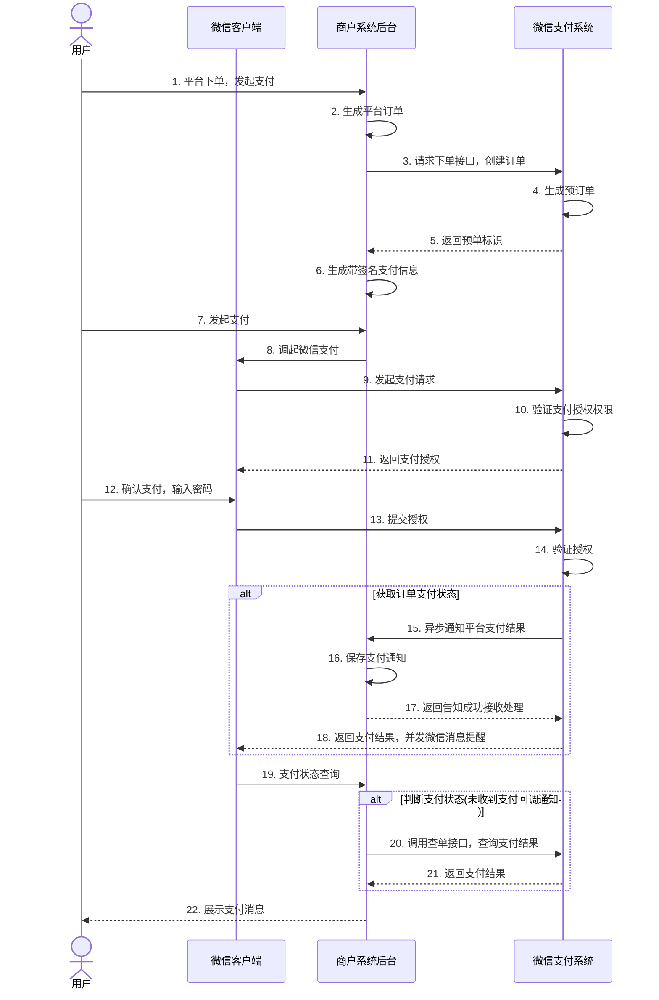

>更新时间：2026.06.08

## 业务流程时序图

图7.9 微信内网页支付时序图

商户系统和微信支付系统主要交互：

1、商户server调用统一下单接口请求订单，api参见公共api【[统一下单API](https://pay.weixin.qq.com/doc/v2/merchant/4011935214.md)】

2、商户前端可通过【[JSAPI调起支付API](https://pay.weixin.qq.com/doc/v2/merchant/4011935213.md)】调起微信支付，发起支付请求。

3、商户server接收支付通知，api参见公共api【[支付结果通知API](https://pay.weixin.qq.com/doc/v2/merchant/4011935221.md)】

4、商户server查询支付结果，api参见公共api【[查询订单API](https://pay.weixin.qq.com/doc/v2/merchant/4011935215.md)】（查单实现可参考：[支付回调和查单实现指引](https://pay.weixin.qq.com/doc/v2/merchant/4011984682.md)）