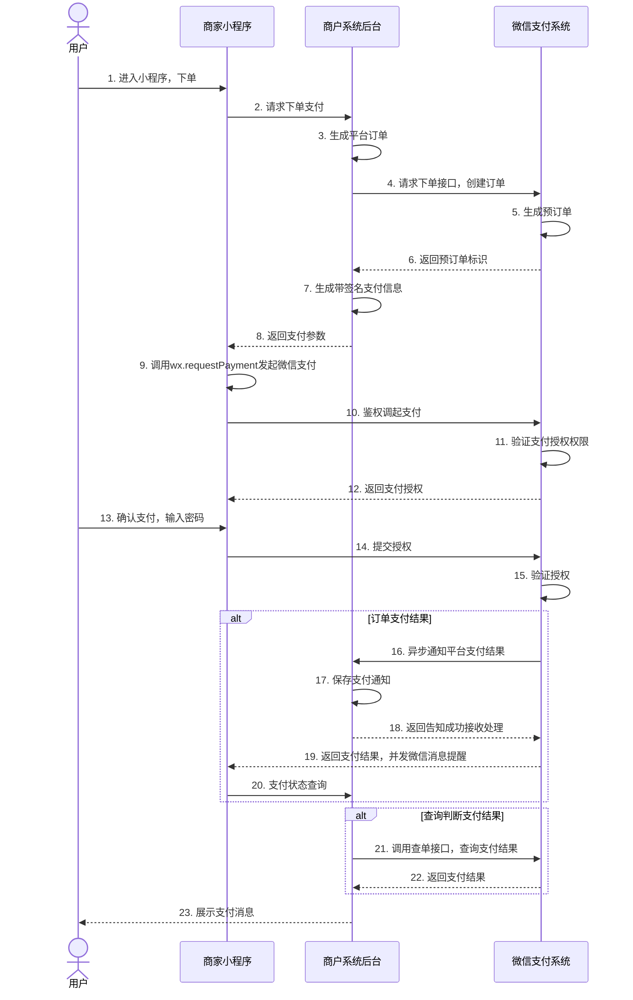

>更新时间：2026.06.10

业务流程时序图

小程序支付的交互图如下：

商户系统和微信支付系统主要交互：

1、小程序内调用登录接口，获取到用户的openid,api参见公共api【[小程序登录API](https://developers.weixin.qq.com/miniprogram/dev/api/open-api/login/wx.login.html)】

2、商户server调用支付统一下单，api参见公共api【[统一下单API](https://pay.weixin.qq.com/doc/v2/merchant/4011940985.md)】

3、商户server调用再次签名，api参见公共api【[再次签名](https://pay.weixin.qq.com/doc/v2/merchant/4011939566.md)】

4、商户server接收支付通知，api参见公共api【[支付结果通知API](https://pay.weixin.qq.com/doc/v2/merchant/4011941607.md)】

5、商户server查询支付结果，如未收到支付通知的情况，商户后台系统可调用【[查询订单API](https://pay.weixin.qq.com/doc/v2/merchant/4011941128.md)】 （查单实现可参考：[支付回调和查单实现指引](https://pay.weixin.qq.com/doc/v2/merchant/4011984682.md)）

6、商户小程序内使用[小程序调起支付API](https://pay.weixin.qq.com/doc/v2/merchant/4011939566.md)（wx.requestPayment）发起微信支付，详见[小程序API文档](https://developers.weixin.qq.com/miniprogram/dev/api/payment/wx.requestPayment.html)