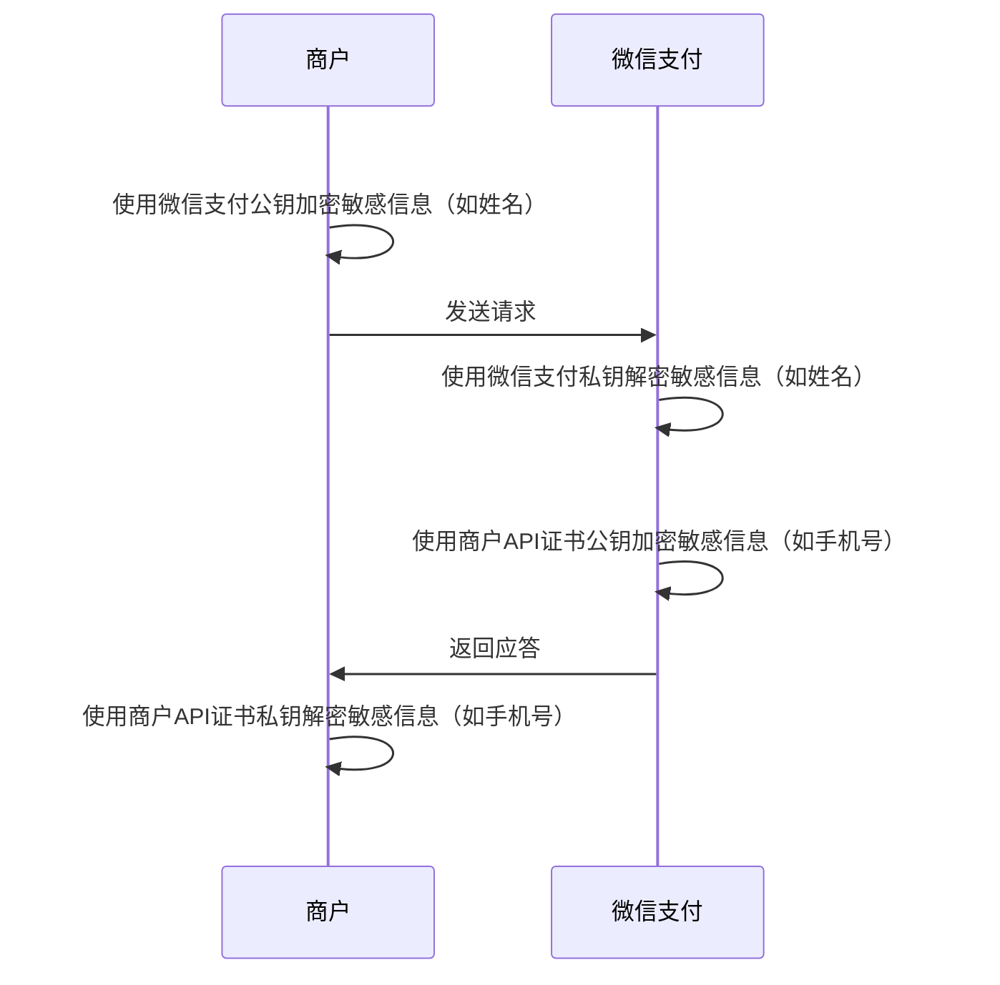

>更新时间：2026.05.20

## 1. 什么是微信支付公钥？

金融类互联网应用的消息真实性和完整性至关重要。商户系统在收到微信支付的应答或回调通知时，需要验证消息的真实性（确保来自微信支付）和完整性（未被第三方篡改）。 微信支付对 HTTP 关键信息提供数字签名。商户通过使用微信支付公钥验证签名，可以确认收到的消息确实来自微信支付，而非其他恶意方伪造。这样，商户可以安心处理交易请求，避免因信任错误来源而导致的潜在风险。

## 2. 什么场景使用微信支付公钥？

### 2.1 验签场景

场景1: 微信支付应答商户的请求时，商户需要使用微信支付公钥验签。

场景2: 接收微信支付的回调时，商户需要使用微信支付公钥验签验签。

| （1）请求应答场景 | （2）回调场景 |
| --- | --- |
| ```mermaid<br>sequenceDiagram<br>    rect rgb(255,255,255)<br>    participant 商户<br>    participant 微信支付<br>    %% 商户自操作<br>    商户->>商户: 使用商户API证书私钥生成签名<br>    %% 发起请求<br>    商户->>微信支付: 发起业务请求<br>    %% 微信支付验签<br>    微信支付->>微信支付: 使用商户API证书公钥验证签名<br>    %% 正确无底色框选（修复版）<br>    rect rgb(255,255,255)<br>    微信支付->>微信支付: 使用微信支付私钥生成签名<br>    微信支付->>商户: 返回应答信息<br>    商户->>商户: 使用微信支付公钥验证签名<br>    end<br>    end<br>``` | ```mermaid<br>sequenceDiagram<br>    rect rgb(255,255,255)<br>    participant 商户<br>    participant 微信支付<br>    %% 微信支付自操作<br>    微信支付->>微信支付: 使用APIv3密钥加密回调信息<br>    %% 红框区域，使用rect做无底色框选<br>    rect rgb(255,255,255)<br>        微信支付->>微信支付: 使用微信支付私钥生成签名<br>        微信支付->>商户: 发送回调信息<br>        商户->>商户: 使用微信支付公钥验证签名<br>    end<br>    %% 后续流程<br>    商户->>商户: 使用APIv3密钥解密回调信息<br>    商户->>微信支付: 返回处理结果<br>    end<br>``` |

### 2.2 敏感字段加解密场景

某些场景商户上送一些敏感信息，例如姓名信息，商户需要使用微信支付公钥加密敏感信息，上送给微信微信支付，确保敏感信息只有微信支付可以解密处理



## 3.如何获取微信支付公钥

超级管理员或者安全联系人登录商户平台，进入账户中心-API安全页面，点击申请公钥后，可下载微信支付公钥

| 1）帐户中心->API安全 | （2）微信支付公钥入口页面 | （3）微信支付公钥详情页（点击下载公钥后，可看到公钥id） |
| --- | --- | --- |
|  |  |  |

## 4. 如何使用微信支付公钥

### 4.1  此前未对接过微信支付的商户，如何使用微信支付公钥？

如果你是个新公司，新申请了一个商户号，此前也从未对接过微信支付，请参考如下说明完成对接

（1）请参考[如何使用微信支付公钥验签](https://pay.weixin.qq.com/doc/v3/merchant/4013053249.md)实现验签。

（2）请参考[如何使用微信支付公钥加密敏感信息](https://pay.weixin.qq.com/doc/v3/merchant/4013053257.md)实现敏感信息加解密。

### 4.2 此前已经使用平台证书对接过微信支付，如何从平台证书切换成微信支付公钥

（1）如果你此前已经使用过平台证书模式，且要将业务系统从平台证书模式全量切换到微信支付公钥模式或者想实现两种模式的兼容，请参考[如何从平台证书切换成微信支付公钥](https://pay.weixin.qq.com/doc/v3/merchant/4012154180.md)一步一步完成操作