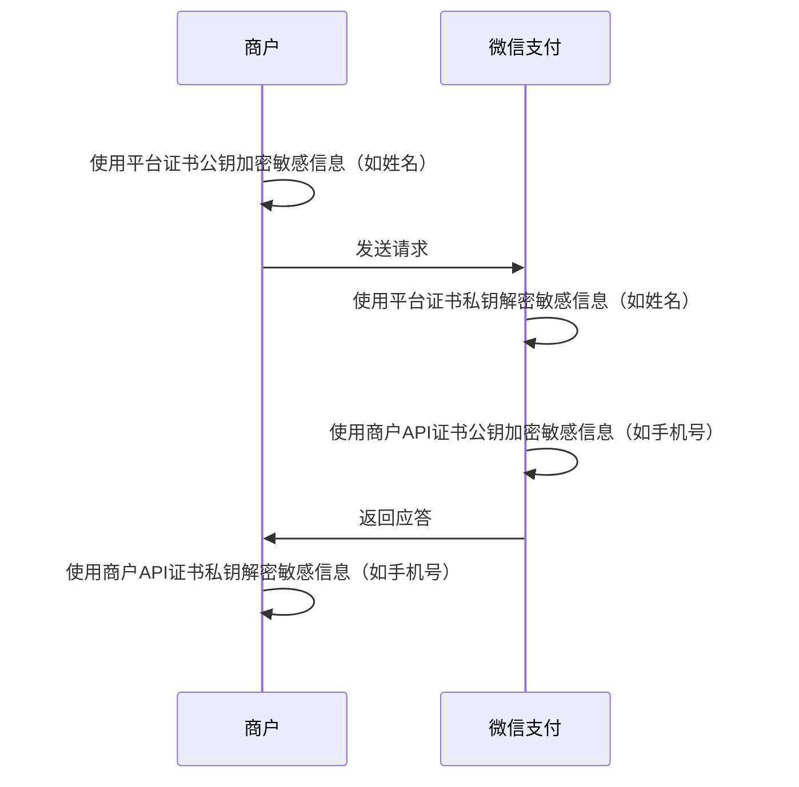

>更新时间：2026.05.20

## 1. 请使用微信支付公钥方式

因为每张平台证书有效期为5年，如果未及时更换会影响业务，建议使用微信支付公钥模式对接，可以按需更新公钥。

如果你是第一次对接微信支付，此前从未使用过平台证书，请参考[微信支付公钥指引](https://pay.weixin.qq.com/doc/v3/merchant/4012153196.md) 完成对接。

如果你此前对接过平台证书，请参考[平台证书切换成为微信支付公钥指引](https://pay.weixin.qq.com/doc/v3/merchant/4012154180.md) 完成对接

## 2. 什么是平台证书？

金融类互联网应用的消息真实性和完整性至关重要。商户系统在收到微信支付的应答或回调通知时，需要验证消息的真实性（确保来自微信支付）和完整性（未被第三方篡改）。 微信支付对 HTTP 关键信息提供数字签名。商户通过使用平台证书公钥验证签名，可以确认收到的消息确实来自微信支付，而非其他恶意方伪造。这样，商户可以安心处理交易请求，避免因信任错误来源而导致的潜在风险。

注意：

平台证书的有效期为5年，即每5年，商户需要更换一次证书，如果你的系统未实现平滑切换，未能及时更换新证书则会导致接口调用异常，若你使用平台证书请务必实现平滑切换。或者你可以将平台证书切换成微信支付公钥模式，微信支付公钥没有物理过期时间，商户可以按照业务需求，按需更换。具体参考[如何从平台证书切换成微信支付公钥](https://pay.weixin.qq.com/doc/v3/merchant/4012154180.md)

## 3. 什么场景使用平台证书？

### 3.1 验签场景

场景1: 微信支付应答商户的请求时，商户需要使用平台证书公钥验签。

场景2: 接收微信支付的回调时，商户需要使用平台证书公钥验签。

| （1）请求应答场景 | （2）回调场景 |
| --- | --- |
| ```mermaid<br>sequenceDiagram<br>    rect rgb(255,255,255)<br>    participant 商户<br>    participant 微信支付<br>    %% 商户自操作：生成签名<br>    商户->>商户: 使用商户API证书私钥生成签名<br>    %% 发起业务请求<br>    商户->>微信支付: 发起业务请求<br>    %% 微信支付自操作：验签<br>    微信支付->>微信支付: 使用商户API证书公钥验证签名<br>    %% 红框内的应答流程，用无底色 rect 框选<br>    rect rgb(255,255,255)<br>        微信支付->>微信支付: 使用平台证书私钥生成签名<br>        微信支付->>商户: 返回应答信息<br>        商户->>商户: 使用平台证书公钥验证签名<br>    end<br>    end<br>``` | ```mermaid<br>sequenceDiagram<br>    rect rgb(255,255,255)<br>    participant 商户<br>    participant 微信支付<br>    %% 微信支付自操作：加密回调信息<br>    微信支付->>微信支付: 使用APIv3密钥加密回调信息<br>    %% 红框内的回调验签流程，用无底色 rect 框选<br>    rect rgb(255,255,255)<br>        微信支付->>微信支付: 使用平台证书私钥生成签名<br>        微信支付->>商户: 发送回调信息<br>        商户->>商户: 使用平台证书公钥验证签名<br>    end<br>    %% 后续流程<br>    商户->>商户: 使用APIv3密钥解密回调信息<br>    商户->>微信支付: 返回处理结果<br>    end<br>``` |

### 3.2 敏感字段加解密场景

某些场景商户上送一些敏感信息，例如姓名信息，商户需要使用平台证书公钥加密敏感信息，上送给微信微信支付，确保敏感信息只有微信支付可以解密处理



## 4. 如何获取平台证书

### 4.1 首次获取平台证书

第一次获取平台证书需要通过证书工具，请按照以下3个步骤操作

（1）[点击](https://github.com/EliasZzz/CertificateDownloader/releases)[这里](https://github.com/EliasZzz/CertificateDownloader/releases)下载jar包

（2）执行以下命令

```
java -jar CertificateDownloader.jar -k ${apiV3key} -m ${mchId} -f ${mchPrivateKeyFilePath} -s ${mchSerialNo} -o ${outputFilePath}
```

你会得到平台证书，文件名类似于wechatpay\_123456777B4A9CC78902B44B65E04B9751CE12.pem。

参数说明

- APIv3 key：是指APIv3密钥，在账号中心->API安全->APIv3密钥中设置，参考[什么是APIV3密钥，如何获取APIv3密钥](https://pay.weixin.qq.com/doc/v3/merchant/4013053267.md)

- mchId：是指商户号

- mchPrivateKeyFilePath：商户API证书私钥存放的路径，你需要获取商户API证书私钥（apiclient\_key.pem），并保存到某个路径。[什么是商户API证书，如何获取商户API证书](https://pay.weixin.qq.com/doc/v3/merchant/4013053053.md)

- mchSerialNo：商户API证书的序列号，参考[什么是商户API证书，如何获取商户API证书](https://pay.weixin.qq.com/doc/v3/merchant/4013053053.md)

- outputFilePath：平台证书保存的路径，开发者自定义


（3）验证证书有效性

第一次下载证书后，我们强烈建议参考[如何通过证书信任链验证平台证书](https://pay.weixin.qq.com/doc/v3/merchant/4012069411.md#%E5%A6%82%E4%BD%95%E9%80%9A%E8%BF%87%E8%AF%81%E4%B9%A6%E4%BF%A1%E4%BB%BB%E9%93%BE%E9%AA%8C%E8%AF%81%E5%B9%B3%E5%8F%B0%E8%AF%81%E4%B9%A6%EF%BC%9F)，验证证书的真实性。

### 4.2  后续获取平台证书

除了首次下载证书需要通过以上方式，后续下载证书请使用微信支付平台证书下载接口

## 5. 如何更新平台证书

如果你此前对接过平台证书，且来不及在平台证书过期前切换成公钥模式，可以[平台证书更换操作指引](https://pay.weixin.qq.com/doc/v3/merchant/4012068829.md)先完成更新，然后再参考[如何将平台证书切换到微信支付公钥](https://pay.weixin.qq.com/doc/v3/merchant/4012154180.md) 完成对接