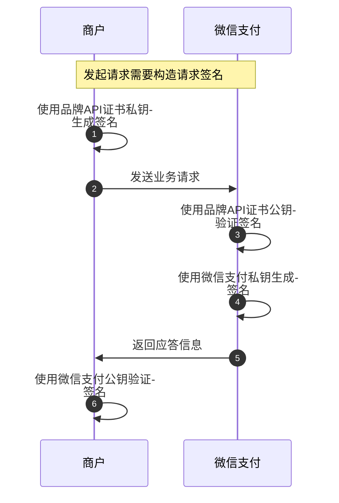

>更新时间：2026.06.23

## 概述

在微信支付品牌API的所有请求应答场景、接口回调场景，开发者都需要进行签名验签。

## 1. 什么时候需要签名？如何签名？

以下场景需要构造签名



### 请求微信支付接口

品牌商户调用微信支付接口的时候需要用到品牌API证书（[什么是品牌API证书？如何获取品牌API证书？](https://pay.weixin.qq.com/doc/brand/4015407570.md)）构造请求签名，且根据请求参数类型的不同，签名方式有所差异，请参考一下的操作指引说明

（1）[请求参数里带Path参数（路径参数），如何计算签名](https://pay.weixin.qq.com/doc/brand/4015407573.md)

（2）[请求参数里带Body参数(包体参数），如何计算签名](https://pay.weixin.qq.com/doc/brand/4015407575.md)

（3）[请求参数里有Query（查询参数），如何计算签名](https://pay.weixin.qq.com/doc/brand/4015407576.md)

（4）[图片上传接口，如何计算签名](https://pay.weixin.qq.com/doc/brand/4015407574.md)

## 2. 什么时候需要验签？如何验签？

以下2种场景品牌商户需要验签，验证请求是来自微信支付

| 微信支付应答品牌商户的请求时，品牌商户需要验签（验证请求是来自微信支付） | 接收微信支付的回调时，品牌商户需要验签（验证请求是来自微信支付） |
| --- | --- |
| ```mermaid<br>%%{init: { "sequence": { "wrap": true, "wrapPadding": 10, "noteAlign": "left" } } }%%<br>sequenceDiagram<br>    autonumber<br>    participant Mch as 商户<br>    participant WxPay as 微信支付<br>    Mch->>Mch: 使用品牌API证书私钥生成签名<br>    Mch->>WxPay: 发送业务请求<br>    WxPay->>WxPay: 使用品牌API证书公钥验证签名<br>    WxPay->>WxPay: 使用微信支付私钥生成签名<br>    WxPay->>Mch: 返回应答信息<br>    Mch->>Mch: 使用微信支付公钥验证签名<br>``` | ```mermaid<br>%%{init: { "sequence": { "wrap": true, "wrapPadding": 10, "noteAlign": "left" } } }%%<br>sequenceDiagram<br>    autonumber<br>    participant Mch as 商户<br>    participant WxPay as 微信支付<br>    WxPay->>WxPay: 使用品牌API密钥加密回调信息<br>    WxPay->>WxPay: 使用微信支付私钥生成签名<br>    WxPay->>Mch: 发送回调信息<br>    Mch->>Mch: 使用微信支付公钥验证签名<br>    Mch->>Mch: 使用品牌API密钥解密回调信息<br>    Mch->>WxPay: 返回处理结果<br>``` |

### 2.1 接收微信支付应答

微信支付应答品牌商户的请求时，品牌商户需要验签，请参考[如何使用微信支付公钥验签](https://pay.weixin.qq.com/doc/brand/4015407582.md)

### 2.2 接收微信支付回调请求

接收微信支付的回调时，品牌商户需要验签

（1）微信支付会使用品牌API密钥加密回调信息，品牌商户需要使用品牌API密钥解密回调信息，参考[如何解密微信支付回调报文](https://pay.weixin.qq.com/doc/brand/4015407591.md)

（2）回调验签请参考[如何使用微信支付公钥验签](https://pay.weixin.qq.com/doc/brand/4015407582.md)