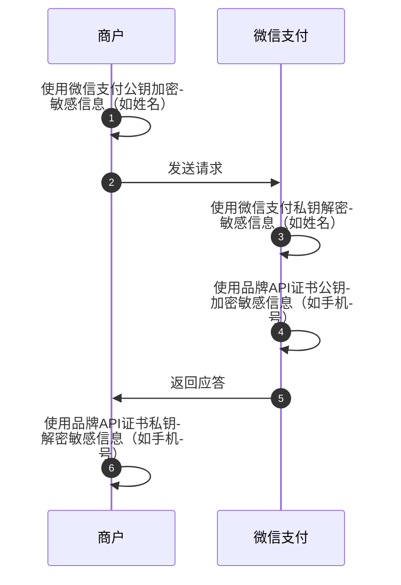

>更新时间：2026.06.23

## 1. 什么是微信支付公钥？

金融类互联网应用的消息真实性和完整性至关重要。品牌商户系统在收到微信支付的应答或回调通知时，需要验证消息的真实性（确保来自微信支付）和完整性（未被第三方篡改）。 微信支付对 HTTP 关键信息提供数字签名。品牌商户通过使用微信支付公钥验证签名，可以确认收到的消息确实来自微信支付，而非其他恶意方伪造。这样，品牌商户可以安心处理交易请求，避免因信任错误来源而导致的潜在风险。

## 2. 什么场景使用微信支付公钥？

### 2.1 验签场景

| 场景1：微信支付应答品牌商户的请求时，品牌商户需要使用微信支付公钥验签。 | 场景2：接收微信支付的回调时，品牌商户需要使用微信支付公钥验签。 |
| --- | --- |
| ```mermaid<br>%%{init: { "sequence": { "wrap": true, "wrapPadding": 10, "noteAlign": "left" } } }%%<br>sequenceDiagram<br>    autonumber<br>    participant Mch as 商户<br>    participant WxPay as 微信支付<br>    Mch->>Mch: 使用品牌API证书私钥生成签名<br>    Mch->>WxPay: 发送业务请求<br>    WxPay->>WxPay: 使用品牌API证书公钥验证签名<br>    WxPay->>WxPay: 使用微信支付私钥生成签名<br>    WxPay->>Mch: 返回应答信息<br>    Mch->>Mch: 使用微信支付公钥验证签名<br>``` | ```mermaid<br>%%{init: { "sequence": { "wrap": true, "wrapPadding": 10, "noteAlign": "left" } } }%%<br>sequenceDiagram<br>    autonumber<br>    participant Mch as 商户<br>    participant WxPay as 微信支付<br>    WxPay->>WxPay: 使用品牌API密钥加密回调信息<br>    WxPay->>WxPay: 使用微信支付私钥生成签名<br>    WxPay->>Mch: 发送回调信息<br>    Mch->>Mch: 使用微信支付公钥验证签名<br>    Mch->>Mch: 使用品牌API密钥解密回调信息<br>    Mch->>WxPay: 返回处理结果<br>``` |

### 2.2 敏感字段加解密场景

某些场景品牌商户上送一些敏感信息，例如姓名信息，品牌商户需要使用微信支付公钥加密敏感信息，上送给微信支付，确保敏感信息只有微信支付可以解密处理



## 3.如何获取微信支付公钥

管理员登录品牌经营平台，进入账号管理-安全中心页面，点击申请公钥后，可下载微信支付公钥

| （1）账号管理->安全中心 | （2）微信支付公钥入口页面 | （3）微信支付公钥详情页（点击下载公钥后，可看到公钥id） |
| --- | --- | --- |
|  |  |  |

## 4. 如何使用微信支付公钥

（1）请参考[如何使用微信支付公钥验签](https://pay.weixin.qq.com/doc/brand/4015407582.md)实现验签。

（2）请参考[如何使用微信支付公钥加密敏感信息](https://pay.weixin.qq.com/doc/brand/4015407587.md)实现敏感信息加解密。