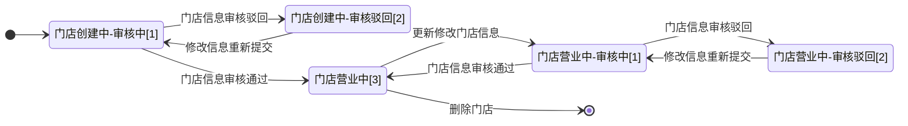

>更新时间：2026.06.10

## 1、整体业务开发流程概览

|     |     |     |     |
| --- | --- | --- | --- |
| 步骤 | 步骤名称 | 操作方式 | 步骤说明 |
| 1 | 创建门店 | 调用「[创建品牌门店](https://pay.weixin.qq.com/doc/brand/4015782988.md)」API | 商家创建新门店时，首先调用此接口获得系统分配的storeid，作为后续流程识别门店的唯一标识。 |
| 2 | 查询门店审核状态 | 调用「[查询品牌门店](https://pay.weixin.qq.com/doc/brand/4015783027.md)」API | 1、微信侧采用机审+人审的方式进行审核，机审不确定时将会进入人审，机审效率较高预计在 1天内完成，人审预计在 7天内容完成。 2、审核通过门店将立即生效，若审核驳回，将返回驳回原因，请调用「[更新品牌门店](https://pay.weixin.qq.com/doc/brand/4015783036.md)」API更新信息。 |
| 3 | 更新品牌门店信息 | 调用「[更新品牌门店](https://pay.weixin.qq.com/doc/brand/4015783036.md)」API | 若门店生效后，希望更新修改信息，可调用此接口执行，更新信息将不会影响门店的生效状态。 |
| 4 | 绑定收款商户号 | 调用「[绑定收款商户号](https://pay.weixin.qq.com/doc/brand/4015782993.md)」API | 此步骤选做，如需建立商户号和门店的关联则需调用此接口，仅支持绑定品牌下已有商户号，请先前往品牌经营平台绑定收款商户号。 |
| 5 | 解绑收款商户号 | 调用「[解绑收款商户号](https://pay.weixin.qq.com/doc/brand/4015783007.md)」API | 此步骤选做，如需解除商户号和门店的关联则调用此接口。 |
| 6 | 删除品牌门店 | 调用「[删除品牌门店](https://pay.weixin.qq.com/doc/brand/4015783019.md)」API | 若门店已关闭，请使用此接口删除。 |
| 若品牌方需要在品牌经营平台上管理品牌门店，可参考：[品牌经营平台管理品牌门店](https://pay.weixin.qq.com/doc/brand/4016689815.md) | 若品牌方需要在品牌经营平台上管理品牌门店，可参考：[品牌经营平台管理品牌门店](https://pay.weixin.qq.com/doc/brand/4016689815.md) | 若品牌方需要在品牌经营平台上管理品牌门店，可参考：[品牌经营平台管理品牌门店](https://pay.weixin.qq.com/doc/brand/4016689815.md) | 若品牌方需要在品牌经营平台上管理品牌门店，可参考：[品牌经营平台管理品牌门店](https://pay.weixin.qq.com/doc/brand/4016689815.md) |

## 2、品牌门店状态流转图

1、品牌门店有【门店状态】、【审核状态】两个状态字段，分别查询门店的生效状态和门店信息的审核状态。

2、品牌商家调用「[创建品牌门店](https://pay.weixin.qq.com/doc/brand/4015782988.md)」接口添加新的门店时，门店状态将流转为“门店创建中”（store\_state：CREATING），相应的审核状态为“门店资料审核中”（audit\_state：PROCESSING）。

- 微信侧采用机审+人审的方式进行审核，机审不确定时将会进入人审，审核通过后门店状态将流转为“门店营业中”（store\_state：OPEN），相应的审核状态为“门店资料审核通过”（audit\_state：SUCCESS）。

- 若审核不通过，门店状态将保持为“门店创建中”（store\_state：CREATING），相应的审核状态为“门店资料审核被驳回”（audit\_state：REJECTED），商家需根据驳回原因修改信息，并调用「[更新品牌门店](https://pay.weixin.qq.com/doc/brand/4015783036.md)」接口提交修改后的信息。

3、门店状态为“门店营业中”（store\_state：OPEN）时，若品牌商家调用「[更新品牌门店](https://pay.weixin.qq.com/doc/brand/4015783036.md)」接口修改门店信息，审核状态将扭转为“门店资料审核中”（audit\_state：PROCESSING），门店状态将不会受到影响仍为“门店营业中”（store\_state：OPEN）；

- 门店信息修改审核通过后，审核状态将扭转为“门店资料审核通过”（audit\_state：SUCCESS），门店状态仍为“门店营业中”（store\_state：OPEN）；

- 若审核不通过，审核状态将流转为“门店资料审核被驳回”（audit\_state：REJECTED），门店状态将不会受到影响仍为“门店营业中”（store\_state：OPEN），商家需根据驳回原因修改信息，并调用「[更新品牌门店](https://pay.weixin.qq.com/doc/brand/4015783036.md)」接口提交修改后的信息。