>更新时间：2026.06.10

## 1、开发前准备

### 1.1、熟悉微信支付接口规则

正式进入开发前，开发者需要先阅读[基本规则](https://pay.weixin.qq.com/doc/brand/4015407525.md)、[如何签名和验签](https://pay.weixin.qq.com/doc/brand/4015407568.md)了解调用微信支付接口的基本规则和签名、验签规则。

### 1.2、准备开发参数

在发起接口请求时，开发者还需传入一些必要参数，如brand\_id(品牌ID)、品牌API证书私钥、公钥等，获取方式详见：[品牌商户模式开发必要参数说明](https://pay.weixin.qq.com/doc/brand/4015415289.md)。

注意事项：

1、开发联调阶段，调用接口后，建议在日志中保留应答的HTTP头 `Request-ID` 值， `Request-ID` 作为[请求的唯一标识](https://pay.weixin.qq.com/doc/brand/4015407525.md#%E8%AF%B7%E6%B1%82%E7%9A%84%E5%94%AF%E4%B8%80%E6%A0%87%E8%AF%86)，在调用接口遇到问题时，可向微信侧提供该值用于快速定位到请求记录，协助排查问题原因。

2、品牌API接入示例可参考[快速调通第一个品牌API](https://pay.weixin.qq.com/doc/brand/4016151253.md)

### 1.3、商品券Skills

微信支付商品券提供了配套的Skill，支持券类型选型、API代码示例、开发参数校验、接口报错排查和上线质量检查，详见：[商品券接入SKill](https://pay.weixin.qq.com/doc/brand/4018922755.md)。

## 2、业务基础概念

### 2.1、基础概念定义

| 概念 | 定义 | 关联关系 |
| --- | --- | --- |
| 品牌 | 所有券的归属主体，统一管理商品券、批次、回调地址。开发时通过 brand\_id 标识品牌，需配置 API 证书进行接口调用 | 1个品牌可创建多个商品券，统一配置1个回调通知地址 |
| 商品券 | 券的母版，定义券名称、使用规则、有效期类型等共性规则，统一管理所有批次（如"满100减20"的券模板） | 1个商品券可包含多个批次 |
| 商品券批次 | 基于商品券创建的发放单元，定义优惠规则、券码方式、发放预算、有效时间、可用门店等配置（如"双11限量1000张全国可用"、"新用户专享每人限领1张"） | 1个批次关联1个商品券，1个批次可发放多个用户商品券 |
| 用户商品券 | 用户商品券：用户领取后持有的实例券，包含券码、券状态、生效时间、核销状态等信息（如用户A领到的"满100减20"双11活动券） | 1个批次可发放多个用户商品券 |
| 门店 | 品牌的线下经营场所，包含门店名称、地址、经纬度、营业时间、服务电话等信息，可被批次关联用于限制券的使用范围 | 1个品牌可创建多个门店，1个批次可关联多个门店 |

### 2.2、券类型与应用场景

| 商户应用场景（示例） | 优惠模式 （usage\_mode） | 适用范围 （scope） | 券类型 （type） | 快速接入 |
| --- | --- | --- | --- | --- |
| 全场满x元x折 / 全场x折支持0门槛 新会员全场9折券：新用户注册即送全场9折券，首单使用，有效期7天 | 单券 （ `SINGLE`） | 全场商品可用券 （ `ALL`） | 折扣券 （ `DISCOUNT`） | [【单券-全场-折扣券】API请求示例](https://pay.weixin.qq.com/doc/brand/4016755503.md) |
| 全场满x减x / 全场立减x支持0门槛 双11满减券：全场满200减50，不限品类，活动期间每人限领1张 开业立减券：新店开业全场立减10元，无消费门槛，每人限领1张 | 单券 （ `SINGLE`） | 全场商品可用券 （ `ALL`） | 满减券 （ `NORMAL`） | [【单券-全场-满减券】API请求示例](https://pay.weixin.qq.com/doc/brand/4016755504.md) |
| 指定品类或品类组合满x元x折 / x折支持0门槛 新品尝鲜7折券：指定新品拿铁7折特惠，每人限购1杯，限量1000份 | 单券 （ `SINGLE`） | 部分商品可用券 （ `SINGLE`） | 折扣券 （ `DISCOUNT`） | [【单券-单品-折扣券】API请求示例](https://pay.weixin.qq.com/doc/brand/4016755505.md) |
| 指定品类或品类组合满x减x / 立减x支持0门槛 超值套餐立减券：汉堡+可乐套餐满30减5，搭配更划算 招牌奶茶立减券：招牌奶茶系列立减3元，无消费门槛，新客专享 | 单券 （ `SINGLE`） | 部分商品可用券 （ `SINGLE`） | 满减券 （ `NORMAL`） | [【单券-单品-满减券】API请求示例](https://pay.weixin.qq.com/doc/brand/4016755506.md) |
| 指定品类或品类组合兑换x支持0门槛 生日三选一兑换券：会员生日赠礼三选一，免费兑换 A.招牌奶茶 B.蛋糕 C.橙汁 新人礼包兑换券：新用户注册即送，免费兑换指定小蛋糕1份 | 单券 （ `SINGLE`） | 部分商品可用券 （ `SINGLE`） | 兑换券 （ `EXCHANGE`） | [【单券-单品-兑换券】API请求示例](https://pay.weixin.qq.com/doc/brand/4016755507.md) |

## 3、接入全流程

### 3.1、核心接入流程

#### 3.1.1、品牌入驻（非API）

品牌入驻是开启品牌经营的第一步，商家可访问微信支付品牌经营平台完成注册流程： [品牌入驻](https://pay.weixin.qq.com/doc/brand/4016389539.md)

注意：

1、注册时的扫码者将成为品牌管理员，拥有成员管理、所有功能的访问和编辑、设置API密钥等最高权限。

2、入驻时需提交管理员信息、主体信息、品牌基础信息及商标资料，管理员姓名和身份证信息需与扫码微信的实名一致。

3、若品牌名称或Logo已注册商标，需上传对应的商标注册证；若商标注册人与主体名称/法人不一致，还需额外提供商标使用许可授权书；若选择"无商标"，则不可使用已注册商标作为品牌名称和Logo。

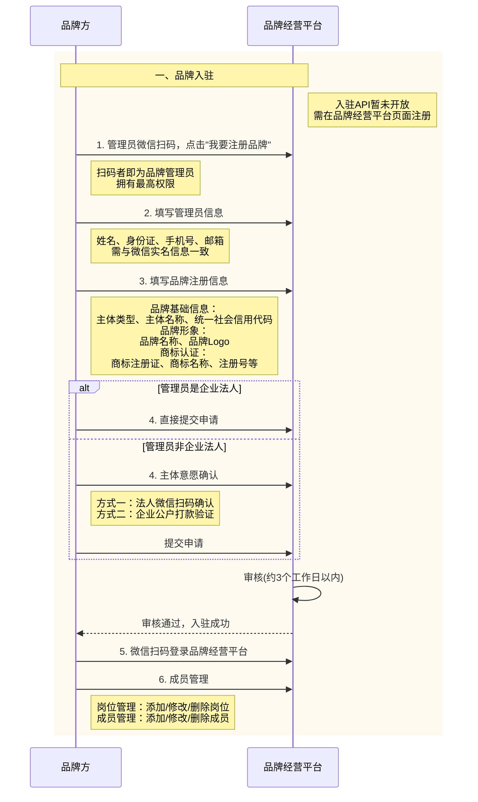

#### 3.1.2、创品牌门店（API，可选）

品牌门店是连接商家线下经营场景的基础数据，商家可通过API或品牌经营平台管理门店信息： [品牌经营平台管理品牌门店](https://pay.weixin.qq.com/doc/brand/4016689815.md)

注意：

1、商家完整录入真实线下门店信息后，在营销投放时可基于门店位置进行精准定位，提升领券转化率；同时在商家名片等场景向用户展示门店位置和经营信息。

2、创建门店后需经过平台审核，审核通过后门店状态变为"营业中"；若被驳回需根据原因修改信息后重新提交。

3、门店已生效后修改信息，门店营业状态不受影响，仅修改内容进入审核流程；审核驳回不会改变门店当前的营业状态。

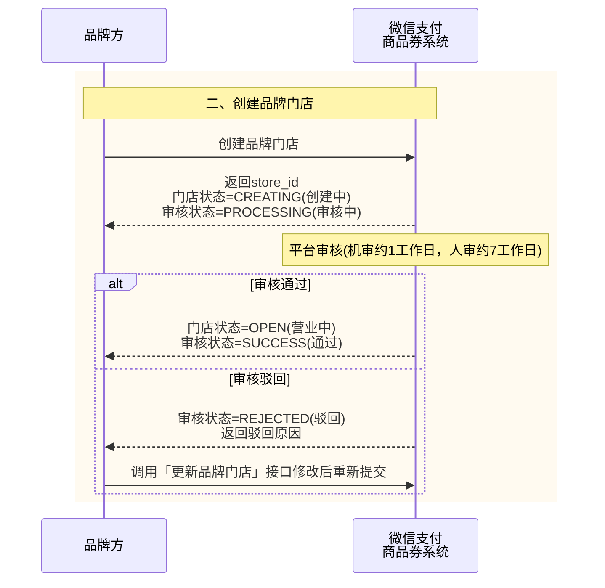

#### 3.1.3、创交易连接名片（非API，可选）

交易连接名片可通过品牌经营平台进行配置： [商家名片配置指引](https://pay.weixin.qq.com/doc/brand/4016401750.md)

注意：

1、配置交易连接前，需先完成商家名片的创建、基础信息及服务列表的配置，并通过审核发布。

2、配置交易连接后，用户支付成功时支付链路将展示品牌头像和名称，支付凭证点击后可跳转至商家名片页面。

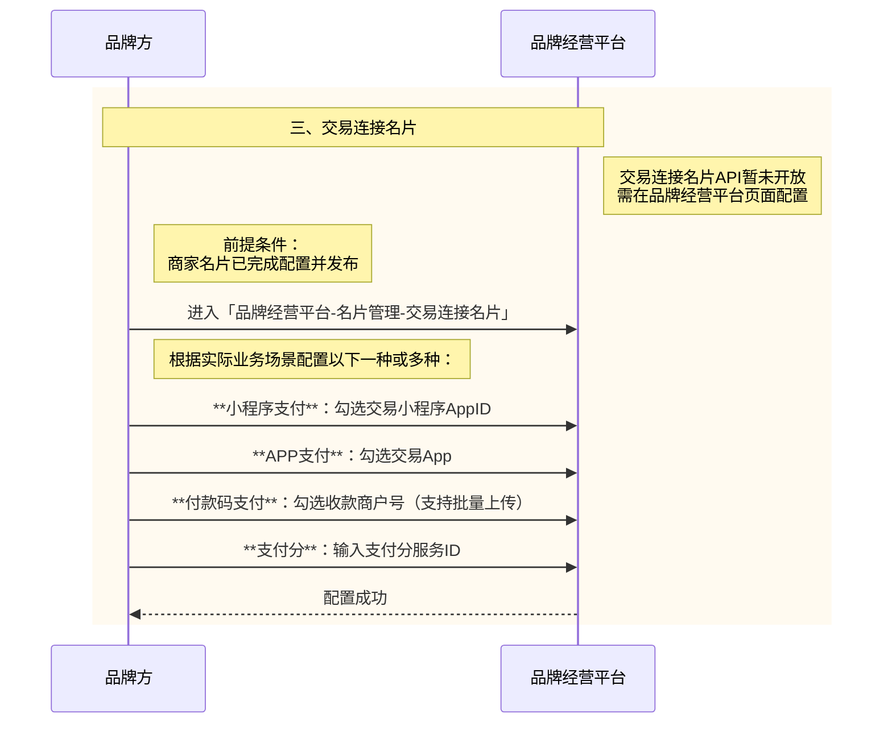

#### 3.1.4、创建商品券（API）

商户系统可以通过API管理商品券：包括 [创建商品券](https://pay.weixin.qq.com/doc/brand/4015736297.md)、 [修改商品券](https://pay.weixin.qq.com/doc/brand/4015736325.md)、 [查询商品券](https://pay.weixin.qq.com/doc/brand/4015736321.md)、 [失效商品券](https://pay.weixin.qq.com/doc/brand/4015736315.md) 的操作，创券示例代码可以参考： [【单券-全场-折扣券】API请求示例](https://pay.weixin.qq.com/doc/brand/4016755503.md)、 [【单券-全场-满减券】API请求示例](https://pay.weixin.qq.com/doc/brand/4016755504.md)、 [【单券-单品-折扣券】API请求示例](https://pay.weixin.qq.com/doc/brand/4016755505.md)、 [【单券-单品-满减券】API请求示例](https://pay.weixin.qq.com/doc/brand/4016755506.md)、 [【单券-单品-兑换券】API请求示例](https://pay.weixin.qq.com/doc/brand/4016755507.md)。

注意：

1、创建商品券的同时也会创建一个商品券批次，若需创建更多批次需另外调用「 [添加商品券批次](https://pay.weixin.qq.com/doc/brand/4015736342.md)」接口。

2、修改后的商品券信息只会对新发的券生效，历史已经发放给用户的券信息不会改变。

3、商品券失效时，商品券下所有批次都会失效。并且会同步终止该商品券所有投放渠道和活动，不会有新的用户领券事件，但历史已经通过该商品券对应的批次发放的用户券仍然有效。

4、图片必须通过「 [图片上传](https://pay.weixin.qq.com/doc/brand/4015736285.md)」接口获取URL，不支持外部链接。

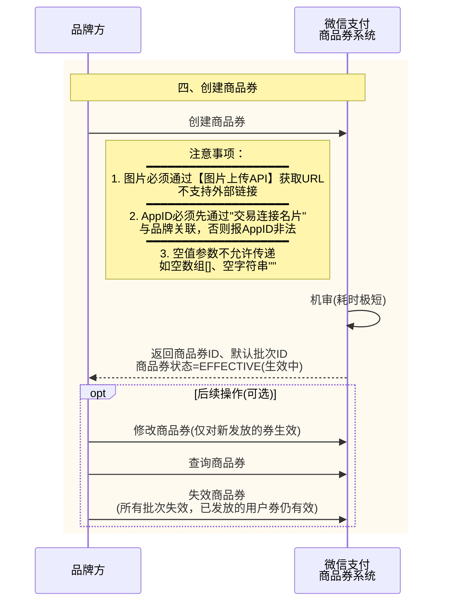

商品券状态流转图：

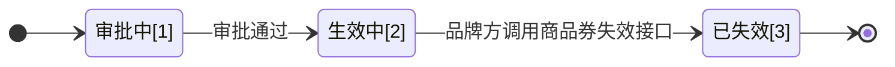

1、品牌方调用「 [创建商品券](https://pay.weixin.qq.com/doc/brand/4015736297.md)」接口创建成功后，商品券会流转为“审批中”(state：AUDITING)状态。

2、微信侧审批方式为机器审核，耗时极短，审批通过后商品券流转为“生效中”(state：EFFECTIVE)状态。

3、品牌方调用「 [失效商品券](https://pay.weixin.qq.com/doc/brand/4015736315.md)」接口后，商品券流转为“已失效”(state：DEACTIVATED)状态。

以下状态为终态：

- “已失效”(state：DEACTIVATED)

#### 3.1.5、创建商品券批次（API）

商户系统可以通过API管理商品券批次：包括 [添加商品券批次](https://pay.weixin.qq.com/doc/brand/4015736342.md)、 [修改商品券批次](https://pay.weixin.qq.com/doc/brand/4015736391.md)、 [查询商品券指定批次](https://pay.weixin.qq.com/doc/brand/4015736373.md)、 [失效商品券批次](https://pay.weixin.qq.com/doc/brand/4015736352.md)、 [批次关联门店](https://pay.weixin.qq.com/doc/brand/4015736339.md) 等的操作。

注意：

1、「 [修改商品券批次](https://pay.weixin.qq.com/doc/brand/4015736391.md)」接口仅能修改批次的基本信息，包括展示信息、通知配置，如需修改预算请调用「 [修改商品券批次发放预算](https://pay.weixin.qq.com/doc/brand/4015736398.md)」接口。修改后的商品券批次信息只会对新发的券生效，历史已经发放给用户的券信息不会改变。

2、「 [修改商品券批次发放预算](https://pay.weixin.qq.com/doc/brand/4015736398.md)」接口每次调用只能调整一个维度的投放预算，如果你需要调整多个维度的预算，请多次调用本接口。

3、「 [失效商品券批次](https://pay.weixin.qq.com/doc/brand/4015736352.md)」接口只会使单个商品券批次失效，不会影响到其他批次。失效后，该批次不会有新的用户领券事件，但历史已经通过该批次发放的用户券仍然有效。。

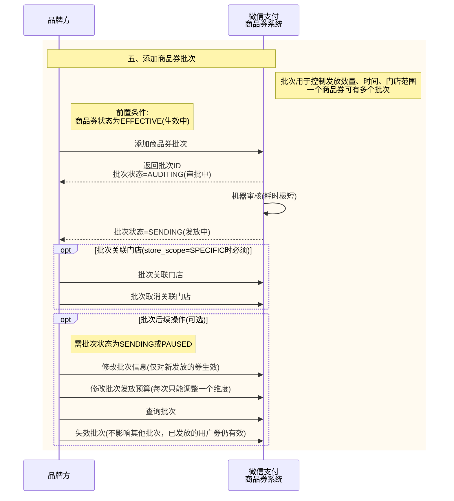

商品券批次状态流转图：

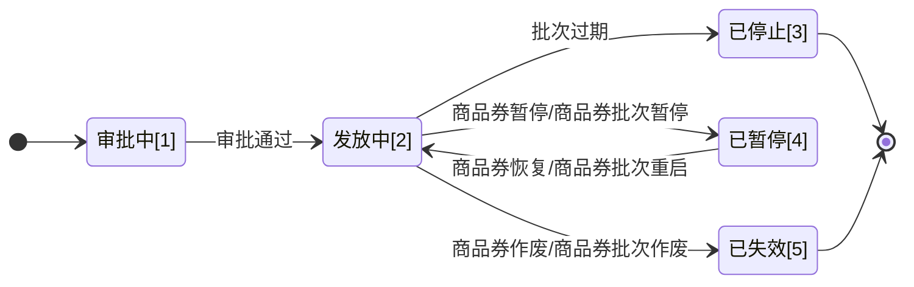

1、品牌方调用「 [添加商品券批次](https://pay.weixin.qq.com/doc/brand/4015736342.md)」接口添加新批次到商品券后，批次会流转为“审批中”(state：AUDITING)状态。

2、微信侧审批方式为机器审核，耗时极短，审批通过后批次流转为“发放中”(state：SENDING)状态。

3、批次在发放中”(state：EFFECTIVE)状态时，以下操作会使商品券批次流转为不同的状态：

- 品牌方如果调用「 [失效商品券](https://pay.weixin.qq.com/doc/brand/4015736315.md)/ [失效商品券批次](https://pay.weixin.qq.com/doc/brand/4015736352.md)」接口，批次会流转为“已失效”(state：DEACTIVATED)状态；

- 批次过期后，批次会流转为“已停止”(state：STOPPED)状态；

以下两个状态为终态：

- “已停止”(state：STOPPED)

- “已失效”(state：DEACTIVATED)

#### 3.1.6、创活动（非API）

投放计划是"摇一摇有优惠"活动的创建工具，商家可通过品牌经营平台进行配置： [投放计划配置指引](https://pay.weixin.qq.com/doc/brand/4016080826.md)。

注意：

1、创建投放计划时需选择商品券及价格批次，价格批次库存需大于等于10000，且仅支持"线上小程序核销"或"微信支付付款码核销"方式。

2、投放计划创建后需经过审核，审核周期通常为2个工作日；审核中仅支持终止操作，驳回后可修改重新提交。

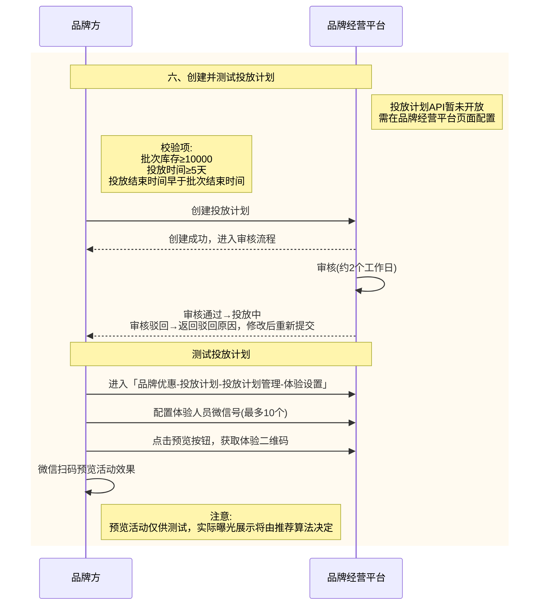

#### 3.1.7、发券（API）

商户系统可以通过API管理用户的商品券：包括 [向用户发放商品券](https://pay.weixin.qq.com/doc/brand/4015736390.md)、 [查询用户商品券详情](https://pay.weixin.qq.com/doc/brand/4015736414.md)、 [退券](https://pay.weixin.qq.com/doc/brand/4015736429.md)、 [失效用户商品券](https://pay.weixin.qq.com/doc/brand/4015736411.md) 等的操作。

注意

1、调用发券接口前要确认已调用「 [设置商品券事件通知地址](https://pay.weixin.qq.com/doc/brand/4015736293.md)」接口。

2、商品券有多个发券渠道，可以由微信支付提供的营销渠道（摇一摇有优惠、商家名片等）发券，品牌方也可以调用「 [向用户发放商品券](https://pay.weixin.qq.com/doc/brand/4015736390.md)」接口主动发券，不论由何渠道发放，微信支付均会发送「 [商品券回调通知](https://pay.weixin.qq.com/doc/brand/4015755761.md)」给品牌方，品牌方需调用「 [确认发放用户商品券](https://pay.weixin.qq.com/doc/brand/4015736403.md)」接口确认发放成功，用户的券才会生效。

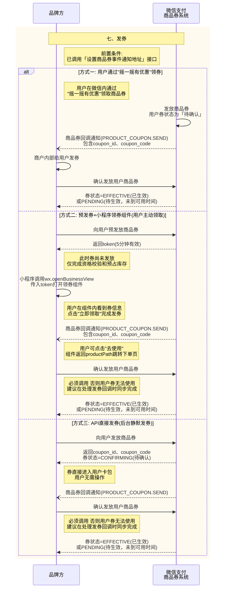

用户商品券状态流转图：

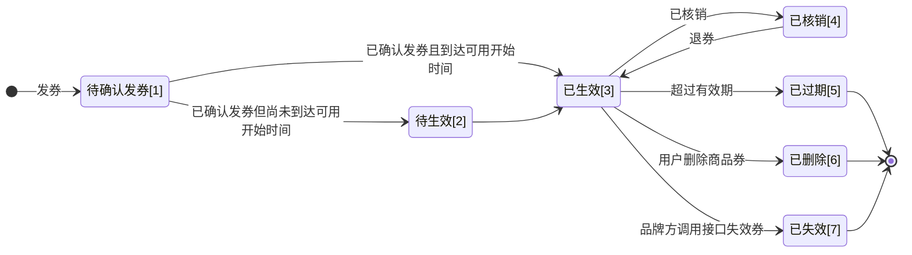

1、微信支付提供的营销渠道（摇一摇有优惠、商家名片等）向用户发券，品牌方也可以调用「 [向用户发放商品券](https://pay.weixin.qq.com/doc/brand/4015736390.md)」接口主动向用户发券，发券后微信会向品牌方发送「 [商品券回调通知](https://pay.weixin.qq.com/doc/brand/4015755761.md)」，此时用户商品券会流转为“待确认发券”(coupon\_state：CONFIRMING)的状态。

2、品牌方收到「 [商品券回调通知](https://pay.weixin.qq.com/doc/brand/4015755761.md)」后，需调用「 [确认发放用户商品券](https://pay.weixin.qq.com/doc/brand/4015736403.md)」接口确认发放成功，确认完成后：

- 若当前时间未到达用户商品券的可用开始时间，用户商品券会从“待确认发券”(coupon\_state：CONFIRMING)流转为“待生效”(coupon\_state：PENDING)的状态；

- 若当前时间到达用户商品券的可用开始时间，用户商品券会从“待确认发券”(coupon\_state：CONFIRMING)或“待生效”(coupon\_state：PENDING)流转为“已生效”(coupon\_state：EFFECTIVE)的状态。

3、用户商品券处于“已生效”(coupon\_state：EFFECTIVE)的状态时，以下操作会使用户商品券流转为不同的状态：

- 品牌方可调用「 [核销用户商品券](https://pay.weixin.qq.com/doc/brand/4015736433.md)」接口进行核销，此时用户商品券会流转为“已核销”(coupon\_state：USED)的状态；

- 用户商品券超过有效期未核销，用户商品券会流转为“已过期”(coupon\_state：EXPIRED)的状态；

- 用户商品券被用户在客户端主动删除后，用户商品券会流转为“已删除”(coupon\_state：DELETED)的状态；

- 品牌方如果调用「 [失效用户商品券](https://pay.weixin.qq.com/doc/brand/4015736411.md)」接口，用户商品券会流转为“已失效”(coupon\_state：DEACTIVATED)的状态。

4、用户商品券核销后，品牌方如果调用「 [退券](https://pay.weixin.qq.com/doc/brand/4015736429.md)」接口，此时用户商品券会从“已核销”(coupon\_state：USED)流转为“已生效”(coupon\_state：EFFECTIVE)的状态。

以下三个状态为终态：

- “已过期”(coupon\_state：EXPIRED)

- “已删除”(coupon\_state：DELETED)

- “已失效”(coupon\_state：DEACTIVATED)

#### 3.1.8、核销（API）

品牌方可通过API核销已发放给用户的商品券： [核销用户商品券](https://pay.weixin.qq.com/doc/brand/4015736433.md)。

注意

1、核销前需确保已成功给用户发券，且用户商品券当前状态为可用；已过期或不存在的券无法核销。

2、核销时需关联订单信息，支持关联微信支付订单（transaction\_id或out\_trade\_no）或微信支付分订单（order\_id或out\_order\_no），二选一。

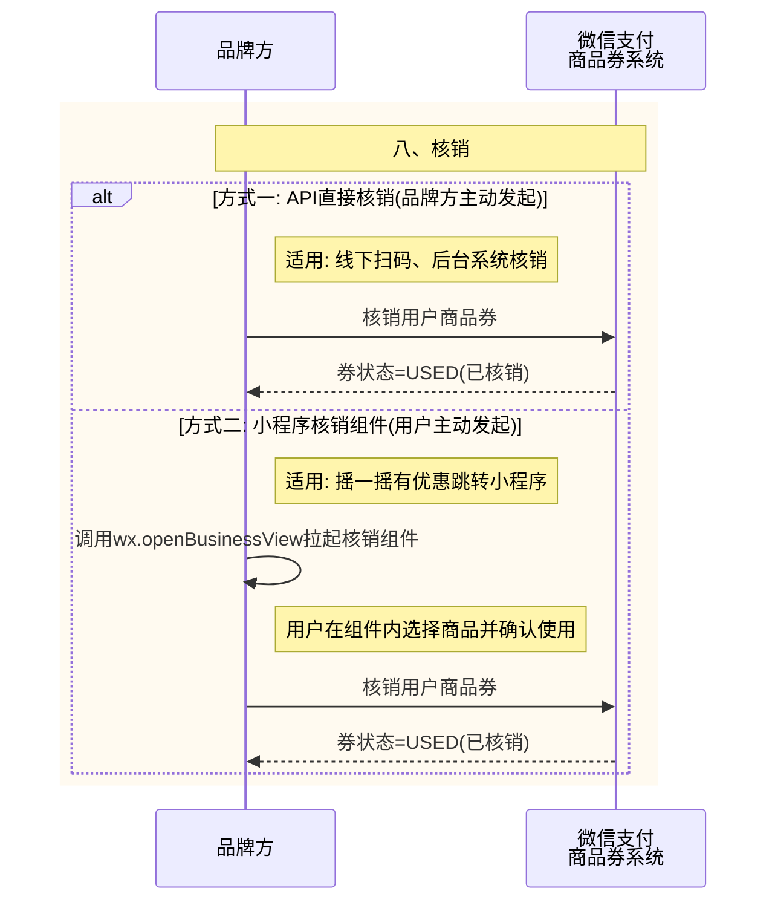

## 4、接口接入说明

### 4.1、必接接口

| API类型 | API名称 | 接口是否与多次优惠共用 | 描述 |
| --- | --- | --- | --- |
| 商品券管理 | 创建商品券 | 是 | 品牌方可以通过该接口创建商品券和批次。微信支付创建成功后，会返回此次创建的商品券以及批次。品牌方可在【经营平台】上配置【活动】对商品券进行投放。 频率限制：接口级限制1000/min 注意：由于该接口参数较多，故按“单券”和“多次优惠”模式的传参要求拆分成了两个文档，实际接口为同一个 |
| 商品券管理 | 修改商品券 | 是 | 品牌方可以通过该接口修改商品券信息。注：修改只会对新发的券生效，历史已经发放给用户的券不会改变。 前置条件：已创建商品券 |
| 商品券管理 | 失效商品券 | 是 | 品牌方可以通过该接口使某个商品券失效。 注意： - 失效商品券会失效商品券所有批次。    - 失效商品券会同步终止该商品券所有投放渠道和活动，不会有新的用户领券事件，但历史已经通过该商品券对应的批次发放的用户券仍然有效。    前置条件：已创建商品券 |
| 商品券批次管理 | 添加商品券批次 | 否 | 品牌方可以通过该接口为已有的商品券添加更多批次，多个批次可以实现品牌方多样化的投放需求。 前置条件：已创建商品券 |
| 商品券批次管理 | 修改商品券批次 | 否 | 品牌方可以通过该接口修改商品券批次的基本信息，包括展示信息、通知配置。 如果你需要调整批次的投放预算，请使用【修改商品券批次发放预算API】 前置条件：已创建商品券批次 |
| 商品券批次管理 | 修改商品券批次发放预算 | 否 | 品牌方可以通过本接口修改商品券批次的投放预算。 注：本接口每次调用只能调整一个维度的投放预算，如果你需要调整多个维度的预算，请多次调用本接口。 前置条件：已创建商品券批次 |
| 商品券批次管理 | 失效商品券批次 | 否 | 品牌方可以通过该接口使已经创建的某个商品券批次失效。 注意： - 调用本接口只会失效单个批次，商品券本身以及其他商品券批次不受影响。    - 失效商品券批次后，该批次不会有新的用户领券事件，但历史已经通过该批次发放的用户券仍然有效。    前置条件：已创建商品券批次 |
| 商品券批次管理 | 批次关联门店 | 否 | 品牌方可以通过该接口将品牌的门店列表与商品券批次关联 前置条件：已创建商品券批次且批次的 `store_scope` 为 `SPECIFIC` |
| 商品券批次管理 | 批次取消关联门店 | 否 | 品牌方可以通过该接口取消品牌的门店列表与商品券批次的关联关系 前置条件：已创建商品券批次且批次的 `store_scope` 为 `SPECIFIC` |
| 用户商品券管理 | 向用户发放商品券 | 否 | 品牌方可以通过本接口向用户发放指定商品券批次，能否发放受限于商品券批次的发放限额： 1. 商品券批次总预算     2. 商品券批次每日预算（如果有）     3. 商品券批次每人限领（如果有）     前置条件：已创建商品券批次，商品券批次处于 `SENDING` 状态 |
| 用户商品券管理 | 确认发放用户商品券 | 是 | 给用户发券后，微信支付会给品牌发送「商品券发放通知」，此时品牌应调用本接口确认发放成功。 注：商品券有多个发券渠道，可以由微信支付提供的营销渠道（摇一摇有优惠、商家名片等）发券，品牌方也可以调用商品券本身的发券API主动发券，不论由何渠道发放，微信支付均会发送该通知给品牌方，品牌方均需调用本接口确认发放成功。 |
| 用户商品券管理 | 核销用户商户券 | 是 | 品牌方可以通过本接口核销已经发放给用户的商品券 前置条件：已经给用户发券成功，且用户券当前可用 |
| 用户商品券管理 | 失效用户商品券 | 否 | 品牌方可以通过本接口将用户的商品券失效 前置条件：已经给用户发券成功 |
| 用户商品券管理 | 退券 | 是 | 品牌方可以通过本接口将已经核销用户的商品券退回给用户 前置条件：已经给用户发券成功，且用户券当前已核销 |
| 商品券回调通知配置 | 设置商品券事件通知地址 | 是 | 品牌方可以通过本接口设置商品券相关事件的回调地址，该地址配置为品牌维度配置，该品牌下的所有商品券相关事件均会通知到该地址。 |
| 商品券回调通知配置 | 获取商品券事件通知地址 | 是 | 品牌方可以通过本接口查询商品券相关事件的回调地址，该地址配置为品牌维度配置，该品牌下的所有商品券相关事件均会通知到该地址。 前置条件：品牌已经配置商品券事件通知地址 |
| 商品券回调通知配置 | 商品券回调通知 | 是 | 用户商品券发放成功后，微信支付会将相关领券结果与用户信息发送给品牌方，品牌方需要接收处理，在品牌侧内部系统为用户发放同样的券。品牌侧发券完成后，还需要调用【 [确认发放用户商品券](https://pay.weixin.qq.com/doc/brand/4015736403.md)】接口进行确认。 回调地址设置方式： 回调地址通过【 [设置商品券事件通知地址](https://pay.weixin.qq.com/doc/brand/4015736293.md)】接口中的 `notify_url` 参数设置，回调地址的设置规范请参考文档： [回调通知注意事项](https://pay.weixin.qq.com/doc/brand/4015407551.md) 注意： - 同样的通知可能会多次发送给商户系统。商户系统必须能够正确处理重复的通知。 推荐的做法是，当商户系统收到通知进行处理时，先检查对应业务数据的状态，并判断该通知是否已经处理。如果未处理，则再进行处理；如果已处理，则直接返回结果成功。在对业务数据进行状态检查和处理之前，要采用数据锁进行并发控制，以避免函数重入造成的数据混乱。    - 商户系统对于开启结果通知的内容一定要做签名验证，并校验通知的信息是否与商户侧的信息一致，防止数据泄露导致出现“假通知”，造成资金损失。 |

### 4.2、选接接口

|     |     |     |     |
| --- | --- | --- | --- |
| 商品券管理 | 查询商品券 | 是 | 品牌方可以通过该接口查询商品券的详细信息，但不包括商品券的批次信息。如果要查询商品券的批次列表，请使用【查询商品券批次列表API】 前置条件：已创建商品券 |
| 商品券批次管理 | 查询商品券批次列表 | 是 | 品牌方可以通过该接口分页查询某个商品券的批次列表。 前置条件：已创建商品券 |
| 商品券批次管理 | 查询商品券指定批次 | 是 | 品牌方可以通过该接口查询某个商品券批次的详情。 前置条件：已创建商品券批次 |
| 商品券批次管理 | 查询批次关联门店列表 | 是 | 品牌方可以通过该接口分页查询商品券批次所关联的门店列表 前置条件：已创建商品券批次且批次的 `store_scope` 为 `SPECIFIC` |
| 商品券批次管理 | 预上传券CODE | 是 | 品牌方可以通过该接口为商品券批次预上传券Code 前置条件：已创建商品券批次，商品券批次的 `coupon_code_mode` 配置为 `UPLOAD` |
| 用户商品券管理 | 查询用户商品券详情 | 是 | 品牌方可以通过本接口查询已经发放给用户的商品券详情 前置条件：已经给用户发券成功 |
| 用户商品券管理 | 指定券状态查询用户商品券列表 | 是 | 品牌方可以通过本接口查询已经发放给用户的特定状态的商品券 前置条件：已经给用户发券成功 |

## 5、附录

### 5.1、 常见问题FAQ

高频疑问汇总（如 ：调用“创建商品券”接口报错：appid非法）请参考： [常见问题](https://pay.weixin.qq.com/doc/brand/4016950448.md)